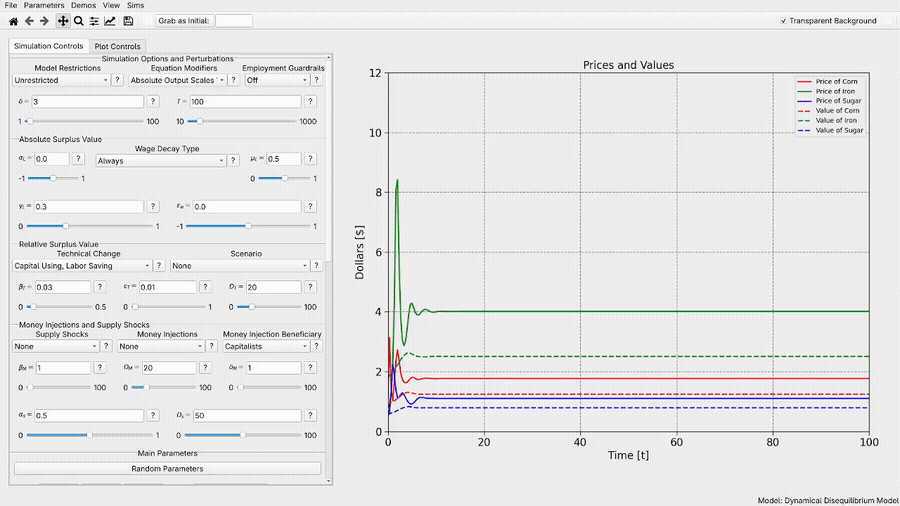

# Overseer

Overseer is a model visualization and exploration toolkit. It aims to make it easy and frictionless to build computer models of all kinds, engage with them dialectically, and create polished learning environments for communicating your models to others. Create Desmos-style interfaces quickly and easily for models of all kinds. Simulation PDE's? Running agent-based simulation? No problem! All you need to do is declare your system parameters, make a single Python function which executes the simulation and returns a dictionary of the plots you want to display, and write up a small yaml file declaring the controls you want to have. The tools will handle the rest and create a display of all of your plots so that you can edit your parameters and view the results in real time. 

# User Guide and Documentation
Detailed documentation on using Overseer is available on [ReadTheDocs.io](https://overseer-modeling.readthedocs.io). Special mention should be made of the [quick-start tutorial](https://overseer-modeling.readthedocs.io) for folks who are looking to get started quickly and learn the details as they go.

# Installation

## Special Releases for Accompanying Papers
This software was primarily developed for the visualization of a few specific models which I am currently writing papers for. If you are just trying to use the accompanying software to those papers, special releases are available for you which can be simply downloaded and ran to display the relevant model. Just click the appropriate link in this section. If you are interested in interacting directly with the tools yourself and making alterations or building your own models, see the instructions below that.

- [For my upcoming paper titled 'Empirical Redemption of Marx's Law of the TEndential Fall in the Rate of Profit Within Dynamic Cross-Dual Disequilibrium Models, click here](https://github.com/alexbcreiner0/Overseer/releases/tag/v1.0.0)
   - [The paper (currently in pre-publishing](https://www.alexcreiner.com/documents/rate-of-profit-paper.pdf)
 
## General Releases
While there are operating specific releases available, I cannot currently recommend using them because the project is being updated too frequently for me to keep these release scripts up to date. [In any case, you can find those links here](https://github.com/alexbcreiner0/Overseer/releases), but I highly recommend that you refer to the 'installing locally' section directly below this in order to install Overseer.

## Installing Locally
If you don't want to go with the official release route, it's easy to run the project directly:
- Install [https://www.python.org/](Python) if you don't have it, make sure you check the 'add to system path' checkbox in the process if you are a Windows user.
- Clone the repo onto your computer (either by opening up a terminal and typing `git clone https://github.com/alexbcreiner0/Overseer.git` (must have git installed) or by downloading and extract the zip folder (found by clicking the green code button))
- Open up a terminal, navigate inside the folder to the folder:
```
cd Overseer 
```
- (Optional but recommended) Create and enter a virtual environment:
```
python -m venv overseer_venv
source venv/bin/activate
```
- Install the package:
```
pip install -e .
```
- Then run the package
```
python -m overseer
```

# Documentation On My Included Models
The example models are not just samples of how to use Overseer. They are simulations I have developed for my own research and put a significant amount of work into. I like to be transparent with my research, so all of the models I develop will be open source and included when you download Overseer. Here is some additional documentation on the included models (not finished currently).

[About My Models](https://github.com/alexbcreiner0/Overseer/blob/main/docs/My%20Models/About%20My%20Models.md)

[Wright's Cross-Dual Disequilibrium Model](https://github.com/alexbcreiner0/Overseer/blob/main/docs/My%20Models/Models-%E2%80%90-Wright's-Cross%E2%80%90Dual-Disequilibrium-Model-(Three-Commodity).md)

[Morishima's Reinvestment Schema Model](https://github.com/alexbcreiner0/Overseer/blob/main/docs/My%20Models/Models-%E2%80%90-Morishima's-Reinvestment-Schema-Model.md)
