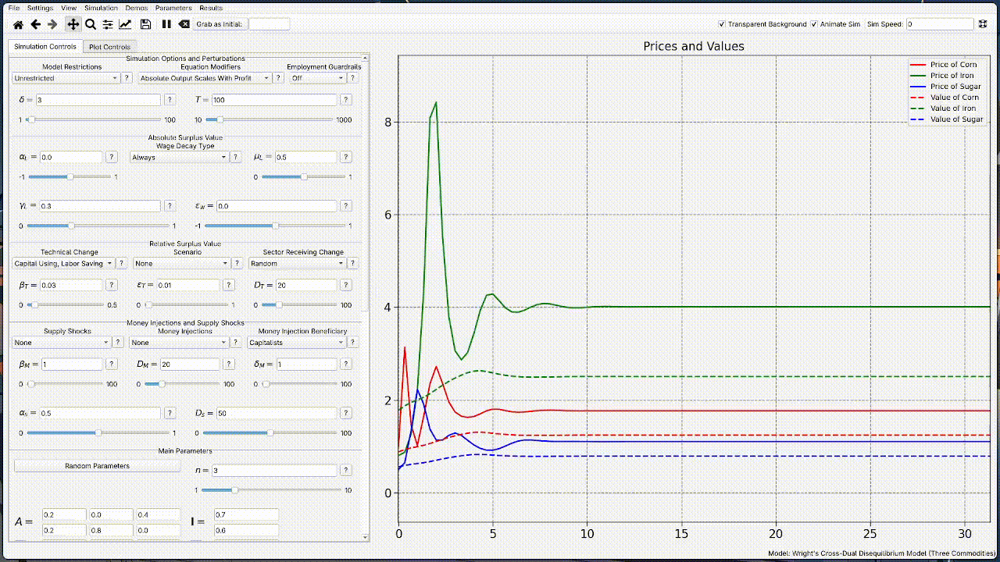
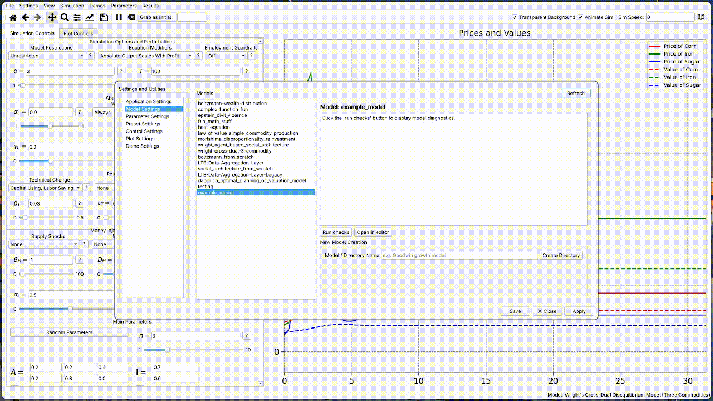
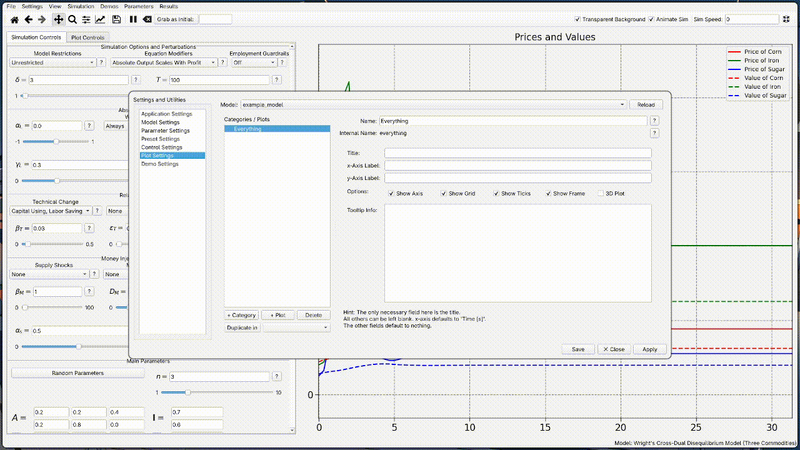
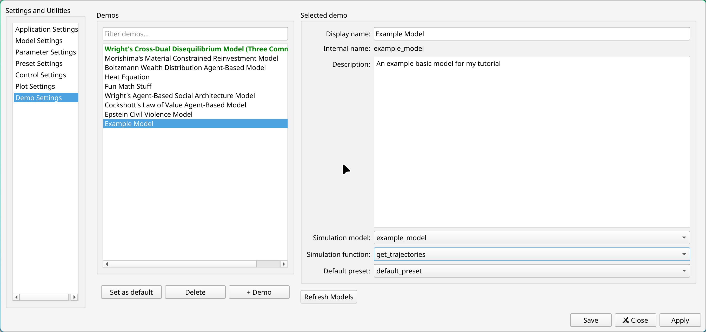
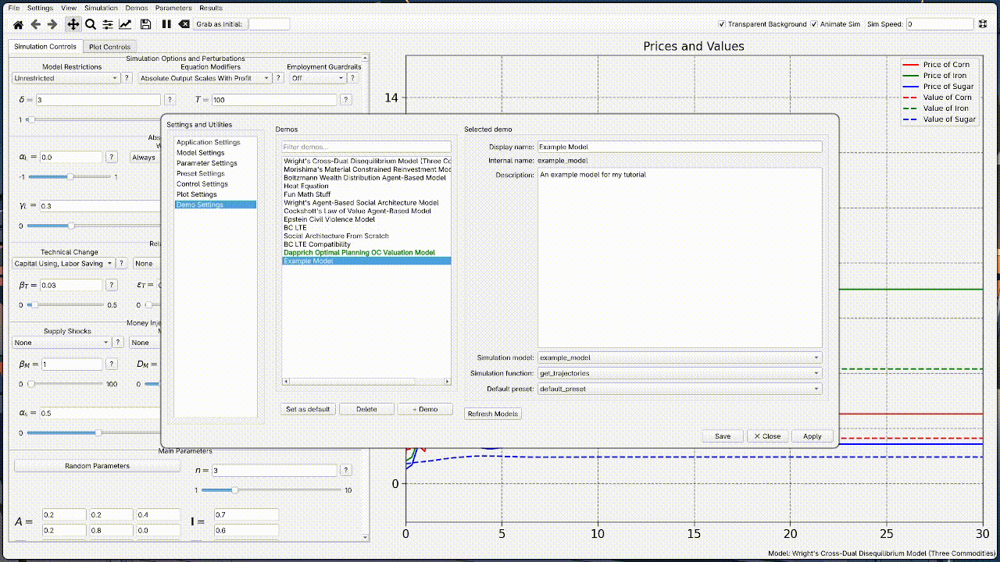
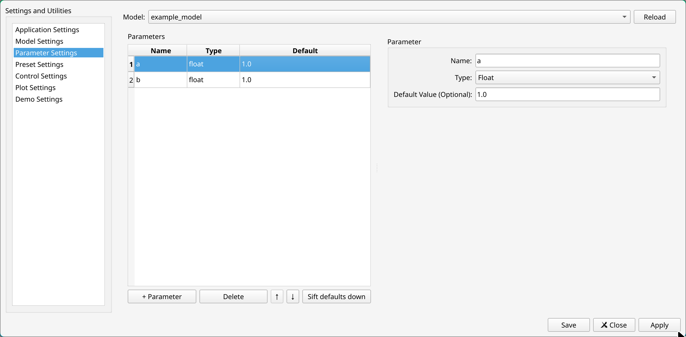
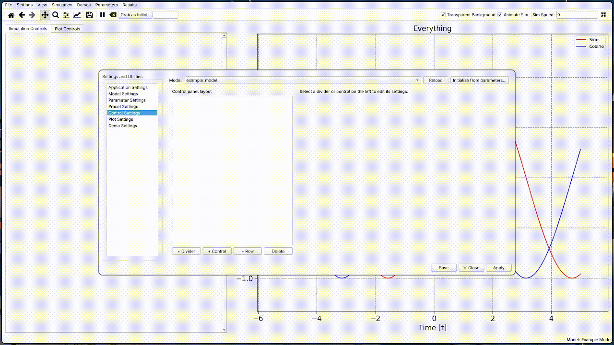
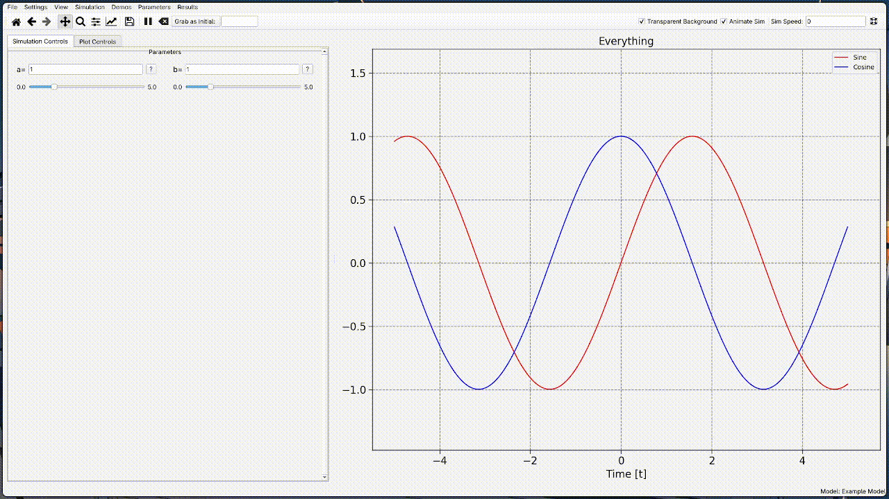
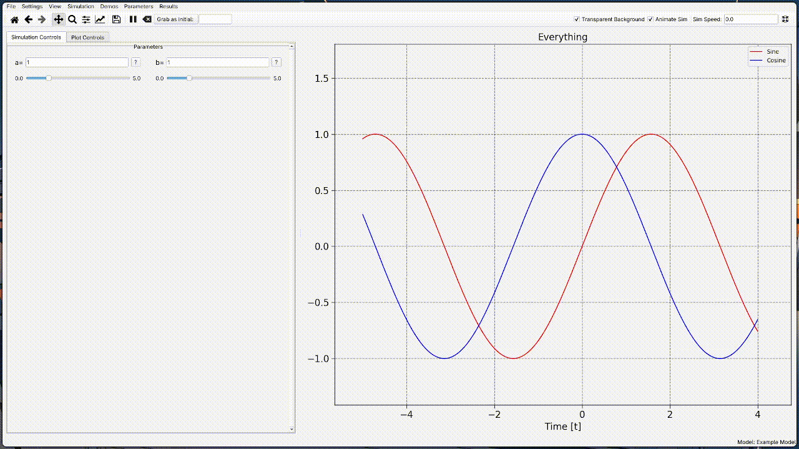

The best way to learn how to use Overseer is to make a few simple models on your own. This tutorial will walk you through doing just that. 
# Building a Model

## Step 1: Create a Model
To get started, navigate in the top menu bar to Settings -> Model Settings. Here you will see a list of models that have been created already - likely just some of my own models, which come packaged with Overseer as examples.

From here, you can create a new model by simply typing a name into the Model / Directory Name entry field and clicking the "Create Directory" button. We'll create one called Example Model.



Once you've done that, you should immediately see an item for your model appear in the list. The name won't be exactly the same as what you typed, but will be similar. 

What just happened? When you first load into Overseer, if you don't have one already, a user data folder called Overseer is created in your user Documents folder. Inside of this is a subdirectory called `models`, which contains a folder for each model that you see listed here. We will keep things brief on this first pass, because there is, in principle, only a single file that you ever actually need to edit yourself to get your model up and running - that file is `simulation.py`. If you select your model in the list and click "Open in Editor", you will open right into it. (You can select your preferred IDE in the application settings.) Alternatively, you can simple open it however you normally would. 

## Step 2: Define Your Sim Function

Inside of the `simulation.py` file for your example model, you should some minimal boilerplate starter code:

```python
from typing import Any
from .parameters import Params
from overseer.tools.dataclasses import Replace, Extend, Append
import numpy as np

def get_trajectories(params: Params) -> dict[str, Any]:
    pass
```

In this file, you are expected to define a simulation function. A simulation function is a normal Python function which takes a single input, which we will talk about in the next section, and returns a dictionary output. This dictionary in principle contains any and all information which you want to use for your plots in Overseer.

Let's have our `get_trajectories` function just create some basic plots of Sine and Cosine:

```python
from typing import Any
from .parameters import Params
from overseer.tools.dataclasses import Replace, Extend, Append
import numpy as np

def get_trajectories(params: Params) -> tuple[dict[str, Any], Any | None]:
    t = np.linspace(-5,5,300)
    traj = {
	    "sine": np.sin(t),
	    "cosine": np.cos(t)
    }
    
    return traj, t
```

If you aren't familiar with Numpy, `np.linspace(-5,5,300)` creates an array of 300 equally spaced numbers between -5 and 5 (inclusive). This will serve as the independent variable, or x-axis. By returning `t` as a second argument like this, we are saying: by default, if the user doesn't specify something different, you are plotting everything with respect to `t`. Alternatively, you can include t as a key in the dictionary:

```python
from typing import Any
from .parameters import Params
from overseer.tools.dataclasses import Replace, Extend, Append
import numpy as np

def get_trajectories(params: Params) -> tuple[dict[str, Any], Any | None]:
    t = np.linspace(-5,5,300)
    traj = {
	    "t": t,
	    "sine": np.sin(t),
	    "cosine": np.cos(t)
    }
    
    return traj
```

If you don't include `t` as a second output, Overseer will automatically look for a "t" key in the output dictionary to use when it doesn't know what your data for a curve or scatter plot should be plotted with respect to. You could also forego on a "t" array entirely, and specify all independent variable axes manually. For some applications, such as the creation of things like heatmaps and pie charts, this is the most sensible option.

This is about as minimal as a model can get. Let's now save our file and return to the Overseer interface to finish creating our model and get our plots on the screen. 

## Step 3: Declare Your Plots
Back in Overseer, let's next move to the Plot Settings tab. Here, you tell Overseer what plots you want to see, how you want them to be organized, and what data to attempt to use for them. 

Plots are organized into **categories**. Think of a category as a collection of related plots that you might (or might not) want to look at at the same time. Create a new category by clicking the +Category button. There are a lot of optional settings here but we'll only bother to fill in the name field, and call this category Everything. 



After this, with the Everything category selected, we can click the +Plot button to create a new plot inside of this category. The picture below shows the relevant fields filled in for plotting our Sine function:



The most important field here is Trajectory Key*. This should be the key of the dictionary output from `get_trajectories` corresponding to the sine outputs. Again, since we either have returned a `t` array explicitly or have one in the output dictionary, we can leave the field underneath blank. Finally, the label + color field specifies what the curve should be listed as in the legend, and the color of the curve. 

To save a bit of time, you can click the Duplicate in button to create a copy of the Sine function, and change a few of the fields to create a Cosine plot. Go ahead and do this yourself, and then click Apply. 

## Step 4: Create a Demo
A **demo**, short for demonstration, is any particular thing which you are looking to 'show off' with your model. Presumably, if you have a very complex model with a lot of flexibility, you might want to create multiple demos for a single model. Click on Demo Settings. 

To create a new demo, click the +Demo button. There isn't a whole lot to specify here. We give our demo a display name and a description, then specify the model to connect it to, the particular function to target, and a default preset (which we don't need to worry about right now because we don't have any parameters). 



This is enough to see our functions. Go ahead and click Save to apply and close the settings. After this, you should be able to find your demo listed in the Demos dropdown of the top menu bar. Click load. 



We have some plots on the screen. Wonderful! But our Simulation Controls to the left are empty. Let's do something about that. 

You might have to do some adjusting to see the plots the way they are pictured. This can be done in a variety of ways, see [the controls section](2%20-%20Controls%20and%20Keybindings.md), but my preferred is to *right click* the screen and drag to change the horizontal and vertical magnification. Once you've found a setup you like, you can click View -> Save current axis settings to attach this view as the default when your demo loads, so that you don't have to futz around with the camera so much next time. 

## Step 5: Declare Parameters
Go to Settings -> Parameter Settings next. A **parameter** is any piece of data which controls something about the model. It can be an int, a float, a string, a Boolean, or even a Numpy array. Let's create two parameters to control the frequency and amplitude of our sine and cosine waves. We'll call them $a$ and $b$, declare them as floats, and have them both default to $1$. 



After this, click Apply, and then move to Control Settings. 

## Step 6: Create Controls
There is a lot to say about the control panel settings, but not a lot that *has* to be said or even understood fully to get a nice control panel up and running. This is because we have a built-in wizard for initializing your controls, assuming you've already declared some parameters. 



There are multiple types of control widgets, but most of the time the type of the parameter gives away the widget that you'll want to use. Here, Overseer infers that because $a$ and $b$ are float parameters, that you want a slider-entry widget for them. Make sure that you also adjust the "Range min" and "Range max" parameters for the two controls. Let's change the "Range max" parameter to 5.0 in both cases. 

## Step 7: Use Parameters In Your Simulation
Now that we've declared our parameters and created some controls for them, how do we make use of them? This is where the `params` input to the `get_trajectories` function comes into play. If we stop to take a look now at `parameters.py`, located in the same folder as the `simulation.py` file, we will see the following:

```python
from dataclasses import dataclass, field
from numpy import array, ndarray

@dataclass
class Params:
    a: float = 1
    b: float = 1
```

We can see that when we declared $a$ and $b$ in Overseer, it went ahead and created for us a [dataclass](https://docs.python.org/3/library/dataclasses.html) with those parameters as properties.  When Overseer runs your simulation, it creates an instance of your this dataclass and passes it to the function. Thus we can simply write `params.a` and `params.b` to reference $a$ and $b$ respectively:

```python
from typing import Any
from .parameters import Params
from overseer.tools.dataclasses import Replace, Extend, Append
import numpy as np

def get_trajectories(params: Params) -> tuple[dict[str, Any], Any | None]:
    a, b = params.a, params.b

    t = np.linspace(-5,5,300)
    traj = {
	    "sine": a*np.sin(b*t),
	    "cosine": a*np.cos(b*t)
    }
    
    return traj, t
```

If we save this and return to Overseer, we can reload and rerun the model by either selecting Simulation -> Reload simulation or pressing F7. Now, whenever we adjust either variable in the control panel, the simulation will be run anew, resulting in different results.



## Step 8: Report Incremental Progress
For real scientific applications, simulations can take a large amount of time to run. It is therefore important for our models to be able to periodically report progress incrementally. This can be done by replacing our `return` keywords with the lesser known `yield`, and turning our function into a [generator](https://wiki.python.org/moin/Generators). 

To put it briefly, a generator is like a function that can be iterated over. Each iteration, the function picks up where it left off until it encounters another yield. The simplest possible example looks like this:

```python
def yield_example():
	yield "dog"
	yield "cat"
	yield "mouse"
	
gen = yield_example()
for out in gen:
	print(out)
```

If we run this code, the loop will repeatedly call yield_example() until there is nothing left to be yielded. The first iteration will run the function until it encounters `"dog"`. Then the next call, it will pick up where it left off, and yield `"cat"`. In contrast, if we used return instead of yield and just called the function three times, it would print `"dog"` three times.

Let's alter our simulation like this to make use of `yield`:

```python
from typing import Any
from .parameters import Params
from overseer.tools.dataclasses import Replace, Extend, Append
import numpy as np

def get_trajectories(params: Params) -> tuple[dict[str, Any], Any | None]:
    a, b = params.a, params.b

    eps = 0.03
    t = np.array([-5])

    for _ in range(300):
        t = np.append(t, t[-1]+eps)
        traj = {
            "sine": a*np.sin(b*t),
            "cosine": b*np.cos(b*t)
        }

        yield traj, t
```

Now we have a `t` array which gradually expands to what it was originally, and are periodically yielding more and more of the Sine and Cosine functions. If we save and reload the model again, things might look the no different from before. This is just because our simulation completes too fast for us to see anything. For the sake of demonstration, we can slow things down by adjusting the Sim speed in the top right corner. Set it to 0.01 and...



## Interlude: Efficient Usage
The code we just wrote isn't very efficient. This is for two reasons:
1. `np.append` creates a brand new copy of the array every time it is called, which we are doing every iteration of the loop.
2. In order to keep the GUI interface smooth and get around Python's [Global Interpter Lock (GIL)](https://realpython.com/python-gil/),  Overseer runs your simulation a separate Python process using Python's built-in multiprocessing module. Because of this, Overseer cannot simply reference the `traj` dictionary directly. The data in `traj` must be [pickled](https://docs.python.org/3/library/pickle.html) and transferred between processes in a serialized format.
If we assume a new piece of data is added to every array element in the dictionary each iteration, and that data is being yielded every iteration, then the data processing here becomes quadratic time $O(n^2)$, where $n$ is the size of the trajectories dictionary. In many if not most applications, this efficiency difference *will not be felt*. I've already had many friends using Overseer falsely blame something slow about their simulation on Overseer. That said, **this efficiency loss can be avoided altogether**, if we are just a little mindful of how we are handling our data. Here is what the fix would look like:

```python
from typing import Any
from .parameters import Params
from overseer.tools.dataclasses import Replace, Extend, Append
import numpy as np

def get_trajectories(params: Params) -> tuple[dict[str, Any], Any | None]:
    a, b = params.a, params.b

    eps = 0.03
    t = -5.0

    for _ in range(300):
        t += eps
        traj = {
            "sine": Append(a*np.sin(b*t)),
            "cosine": Append(b*np.cos(b*t))
        }

        yield traj, Append(t)
```

Let's take stock of what has changed. `t` is no longer a list or a Numpy array. It is just a regular float now, as are the outputs of `a*np.sin(b*t)` and `a*np.cos(b*t)`. However, we aren't yielding these numbers directly. Instead we are wrapping them in a dataclass called `Append`. These three dataclasses, `Append`, `Extend` and `Replace`, tell Overseer how to go about assembling the full `traj` dict itself from the disparate pieces of data which are sent over to it. Recognizing the `Append` wrapper, Overseer will append the latest data points as they appear into a list, after which point the data set as a whole can be referenced directly. No serialized redundant data transfer required. 

Since Overseer maintains the data as lists, and *not* Numpy arrays, the appends are no longer problematic, since Python lists are really [dynamic arrays](https://en.wikipedia.org/wiki/Dynamic_array), for which appending is an (amortized) $O(1)$ time operation. 

Despite being written in Python, Overseer is carefully optimized to not drag you down at all, *provided* you use it to it's full potential. See the dedicated section on `Append`, `Extend` and `Replace` for more details.

## Step 10: Store Your Findings
### Saving Your Output Data
One seeming downside of doing things this way is that now only Overseer possesses the overall results of your simulation as aggregated data. However, Overseer lets you choose to save this data in as a [Numpy savez (.npz) file](https://numpy.org/doc/stable/reference/generated/numpy.savez.html), making the data created within Overseer fully portable, allowing you to easily take it and use it with any other data analysis software. In fact, Overseer is a great launch platform for creating this data in the first place, for more thorough analysis elsewhere. 

To do this, in the top menu bar,  choose Results -> Save current results, give it a name and maybe a description, check the save axis box if you want the view to come with the data when loaded, and click save. After this, the data can be reloaded by going to Results -> The name you gave -> Load results.
### Saving Your Presets
When your model gets complicated with lots of different parameters and controls, you are going to want to save specific configurations of those parameters so that you can easily jump back to where you left off, or show off something more specific.   When preparing release builds to pair with publications, this is especially useful, since you can create a preset for each figure in your paper, allowing for any reviewers to easily reproduce (and not simply view) your results. 

Saving and loading presets is exactly the same process as saving results. Just navigate to Parameters -> Save parameter settings, give it a name and maybe a description, and click save.

# Wrap Up
From here, the idea should be clear - Overseer augments your existing developer environment by giving you a way to incrementally and dialectically build your models. You can make small changes, then switch over to Overseer and tap F7 to immediately see what those small changes result in. 

You're now familiar with all of the core components of Overseer:  models, demos, parameters, presets, controls, categories and plots. See the specific pages for any of these topics for more in depth documentation on how they all work. 