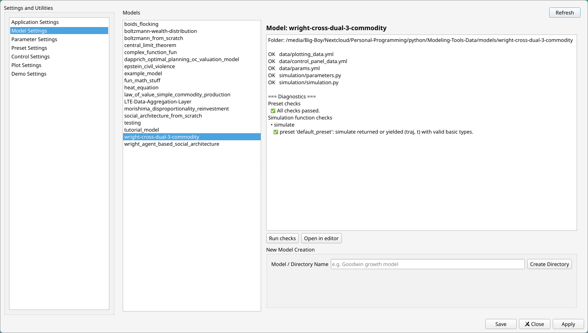
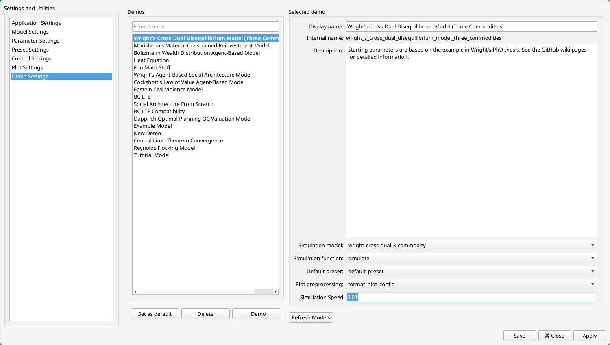

# User Data
In this section, we'll take a closer look at the user-facing files of your Overseer installation, covering where they are and what purposes each of them serves. We'll also look at the structure of a model folder and do the same for that. 
## Config Files
Upon first launching Overseer, a configuration folder will be created in the place where that kind of thing is expected:
- For Linux, look in `~/.config/Overseer`
- For Windows, look in `C:\Users\your_username\AppData\Roaming\Overseer`
- For Mac OS, look in `~/Library/Application Support/Overseer`
The two files created are `config.yml` and `keybindings.yml`. In general, Overseer uses the [yaml](https://en.wikipedia.org/wiki/YAML) format for nearly everything configuration related. 

For the most part, you should never need to do any editing of your `config.yml`, as all of its settings are editable within Overseer itself in the Application Settings. The `keybindings.yml` file, is meant to be edited by the user, but it can be quickly opened for editing from the settings menu.

Overseer does not allow you to change the location of your `config.yml` file, but it can be redirected to point at something different, using either the `--config` option flag or by exporting the `OVERSEER_CONFIG` environment variable. Since all development versions of Overseer merely use wrapper launchers which run the program with a Python command, the launcher file can be easily edited to open alternative config files in the same manner.   

## User Data
By default, a folder called Overseer is created in your user documents folder. This is where all of the data relating to your models and demos will be stored, along with log files which are helpful for debugging your code. Where Overseer looks for this folder can be changed in the application settings, but regardless of where it looks, Overseer expects to see the following structure:

```
Overseer/
├── demos.yml/
├── logs/
│   └── log.jsonl
└── models/
```

### demos.yml
`demos.yml` contains information for each of your demos. A demo listing looks like this:
```
demo_name:
    name: Display Name of Demo
    desc: A description of the demo.
    details:
        simulation_model: model_folder_name
        simulation_function: A function from simulation.py
        default_preset: Initial parameter settings for your simulation
	    axis_settings: How your demo should look when you load it.
	(optional) default: True
```
All of these fields should be edited within the GUI itself, in the Demo Settings. `axis_settings` are the exception. Instead, you can configure the view however you want, and then in the menu go to View -> Save current axis settings to store that view as the default which loads when you open the demo.

Finally, the default field will only ever be present on a single demo, and designates the demo which Overseer opens into. The demo which is highlighted green in the Demo Settings tab is the default demo.

### logs
This folder contains your log files in `json` format. In particular, error messages will appear here when your models fail. However, you never need to actually open this file, since these logs are visible from within Overseer itself in the Logs tab. See [the section on logging](10%20-%20The%20Logger%20and%20You) for more info on how to use Overseer's logging system. 

### models
This folder contains your user-defined models! Thus, let's shift towards what a model looks like in general.

# Models
A model is really just a folder which Overseer has some expectations for. Overseer decides if a folder in your models directory is a model based on whether or not it contains an `__init__.py` file inside of it. You can see your models listed in the GUI model settings:



The model settings tab's main purpose is to create new model directory, initializing the necessary files and subdirectories and giving you some boilerplate starter code. Intentionally, models can only be created in this tab. If you want to delete a model, that's your responsibility and you should do it yourself. 

It also features some limited diagnostic checks that you can access by clicking the 'Run checks' button. Running checks does the following:
1. Checks if you have the the minimum necessary files in the correct places.
2. Tries to instantiate a parameters dataclass based on the default values you specify and your presets.
3. Feeds that to every function in your `simulation.py` file, to perform a test run.
4. If that test run yields or returns anything, it checks to see if what is yielded is in the proper form that Overseer needs for it's operation.
These diagnostic tools are not as robust as they should be, but they are mildly helpful when you are getting off the ground.

Finally, the user can click the 'Open in editor' button to open the folder of the model selected in a preferred text editor or IDE. A selection of common choices for which IDE to target is available in the application settings. 

Now that we are familiarized with the model settings and know how to create a models, let's take a closer look at the general structure of one. 
# Anatomy of a Model
New models are creates inside of the models folder. The basic structure looks like this:

```
model_name/
├── __init__.py
├── data/
│   ├── control_panel_data.yml
│   ├── params.yml
│   └── plotting_data.yml
├── simulation/
|   ├── __init__.py
|   ├── parameters.py
|   ├── extra_functions.py (optional)
|   └── simulation.py
└── saved_results (optional)
```

Starting with a rough breakdown:
- `__init__.py` - this is a completely empty file which initializes your model as its own [dotted namespace](https://docs.python.org/3/tutorial/modules.html), allowing for somewhat more convenient importing and sharing of resources while you build your model. Overseer also uses the presence of this file to distinguish which folders inside of your models directory are models and which aren't. If you don't see your model, it is probably because it is missing an `__init__.py` file.
- `data` contains non-Python data related to your model, in human readable `yaml` format.
- `simulation` contains the actual simulation code. Everything *you* need to is in this folder and this folder only.
- `saved_results` is a directory containing saved data. See the section on [saving your results](9%20-%20Saving%20Pictures,%20Presets,%20and%20Data) for more information on doing this.

## The Simulation Folder
Going through the files here one at a time:
- `simulation.py` is where Overseer looks for functions to use as entrypoints to start your simulation. Multiple simulation functions are allowed, and the specific one to use can be specified in the Demo Settings. However, it is recommended that you create separate Python files for any functions or classes which your simulation makes use of. These additional files can be created here in the simulation folder with no issues. For more details on what exactly is expected of the `simulation.py` function, see the dedicated section on [writing simulations](6%20-%20Writing%20Simulations.md).
- `parameters.py` defines a [dataclass](https://docs.python.org/3/library/dataclasses.html) which contains all relevant starting parameters for your model. Any specific information you want the model to have during its simulation should be stored as a parameter within this dataclass. The [next section](5%20-%20Parameters%20and%20Presets) is dedicated to discussing parameters. However, you should never need to touch this file directly. It is meant to be only indirectly altered using the Overseer GUI settings.
- `extra_functions.py` is an optional extra file that advanced users can create to define functions which give Overseer more sophisticated control of your model. These include:
	- Defining [metaparameters](8%20-%20Control%20Panel%20Widgets#Metaparameters) which allow your parameters to alter the control panel itself. 
	- Creating [functions for your control panel's buttons](8%20-%20Control%20Panel%20Widgets#Buttons) 
	- Defining [plot-preprocessing functions](8%20-%20Control%20Panel%20Widgets#Buttons#Plot%20Pre-Processing) which allow your parameters to alter your plots dynamically based on your parameters.

Above all, it should be emphasized that this folder belongs to you, the user. You can create any number of extra files here to suit your project's needs. Overseer doesn't care, as long as 
1. You always write your code in the simulations folder (or it's sub-folders)
2. You always have *at least* the required files as specified above.

## The Data Folder
Again we'll go through these one at a time:
- `control_panel_data.yml` contains row-by-row information about the controls you want to have in the control panel.
- `params.yml` contains a list of possible starting parameters for your models. The application will be able to create, save, delete and rename them but you must supply it initially with at least one set of values for each parameter.
- `plotting_data.yml` contains plots which you want to be displayed within the application. 

The user is not expected to need to interact with any of these files at all. They are yaml format, which makes them very easy to read and edit manually. That said, for most purposes the GUI interface is significantly more efficient than manual editing, and has a much lower knowledge floor.

Models are the core of Overseer. However, a model on its own is not something which Overseer knows how to open. To actually run your model, you must first define a demo. 
# Demos
In principle, a demo is something specific that you want to show *using* a model:
1. Multiple simulation function entrypoints can be defined for a single model. The demo designates the *specific* function for Overseer to target. 
2. Multiple parameter settings (or presets) can be defined for a single model. The demo designates what the starting parameters should be, through the specification of a preset.
3. Additionally, every demo must contain a name, as well as a possibly empty description, meant to serve as an introduction to the user.

Additionally and optionally, demos can store the following extra data:
3. Axis settings, which define the overall view upon loading the demo. This includes how many slots appear, which categories and plots appear on which slots, and so on. 
4. A speed at which to run the simulation. To have any speed higher than 0 forces the thread looping over the simulation function to sleep for that amount of time. In the future, it will also send information to the simulation itself, suggesting that it slow itself down. 
5. A specified plot preprocessing function which Overseer will use to modify the plot settings in between runs of your simulation, to obtain dynamic plot outputs. (This is obviously an advanced feature. For more details, see [section 8](8%20-%20Control%20Panel%20Widgets#Plot%20Pre-Processing).)

Finally, Overseer must load into a demo when it first starts. One demo can be specified as a default, which Overseer will target when it loads. Demos are defined in the `demos.yml` file of the user data folder. This file does not need to be modified manually, and instead should be interacted with via the Demo Settings tab of the settings:



With this tab, we can create new demos with the +Demo button, fill in the relevant details just described above, and specify a certain demo as the default for Overseer to load into. 

The only aspect of a demo which the demo settings tab does not give you the ability to modify are the axis settings. The reason is that there is no point in trying to make a GUI interface for something like this. Instead, you are expected to create the demo without these settings first, load into it, configure the view however it suits you, and then *attach* these settings to your demo from the top menu via View -> Save current axis settings. Note that because these settings are saved to your demo, there can only be one set of axis settings specified this way. However, axis settings can also be attached to presets and results. You could easily have several variations of the same parameters settings with different axis settings, to give yourself the ability to shift between multiple complex arrangements. 

[Continue to Section 5: Parameters and Presets](5%20-%20Parameters%20and%20Presets)
