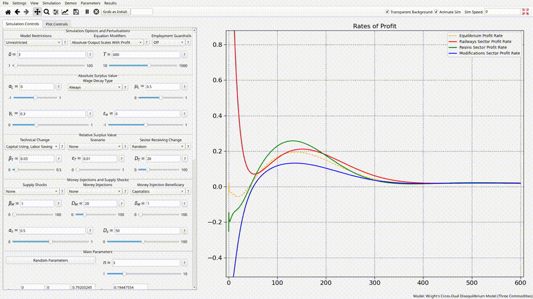

# Initialization
A model **parameter** is any piece of data which the model relies on to define its operation. These can be any type of variable, and Overseer must have a designated value for all of them in order to run your model. 

Parameters can be defined in the Parameter Settings menu:
![[assets/param-settings.png]]

When specifying default values, you should type the value exactly how you would define it if you were writing Python code. So an 2x2 Numpy matrix should be defined as \[\[a,b\],\[c,d\]\], and so on. 

Hitting apply updates the `simulation/parameters.py` file in your model directory. If we were to open it, we would see this:

```python
from dataclasses import dataclass, field
from numpy import array, ndarray

@dataclass
class Params:
    T: int = 200
    N: int = 1000
    M: int = 100000
    w: ndarray = field(default_factory=lambda: array([10,90]))
```

You could easily make this yourself instead of using the GUI, but be mindful of the special way in which the default values for Numpy arrays need to be recorded. These parameters merely define a Python [dataclass](https://docs.python.org/3/library/dataclasses.html), which gets instantiated and handed to your simulation function as input when your simulation starts. 

In order to determine what the actual values of these parameters are supposed to be during initialization, Overseer relies on a specified **preset**. Presets are stored in yaml format, in the `data/params.yml` file of your model folder. They can be managed in the Preset Settings menu:

![[assets/preset-menu.png]]

However, this is mostly only useful for tweaking.  In practice, you will create new presets by arriving at them naturally through experimentation with your controls, and then saving them in the top menu bar by selecting Parameters -> Save parameter settings. The real use for the Preset Settings menu is useful for making small changes to *existing* presets. 

When creating a demo for a model, a default preset **must** be specified, which is what is initially loaded with the demo:
![[assets/default-preset.png]]

When a new model is created, a `simulation/params.yml` is generated automatically with a single preset, called `default_preset`:

```yaml
presets:
  default_preset:
    name: Default
    desc: ''
    params: null
```

The way that Overseer goes about choosing values for each parameter when a simulation begins can now be described as follows. For each parameter, Overseer first consults the specified preset to see if a parameter is specified there. If it is, then we stop here. If it isn't, then Overseer assumes that there is a default value specified in the definition of the `Params` dataclass - i.e. it assumes that *you* picked something for it to default to when defining your parameters. Because of this, you can actually get a model up and running without ever interacting with the preset system, **provided** you specify a default value for every parameter that you define. 

It is considered best practice when using Overseer to specify a default value for every parameter, but this is not always reasonable. The Preset Settings menu will mark parameters that don't have default values with an asterisk, and remind you to set values for them.  If you fail to fill in a parameter field marked by an asterisk and click apply anyway, Overseer *will not save your file*. 

One final note: parameters with default values set become optional arguments, and Python requires that optional arguments always are specified *after* the required arguments. Thus when defining parameters in the Parameter settings menu, you must always have the parameters without defaults appear in the list before the parameters without defaults. The $\uparrow$ and $\downarrow$ allow you to easily reorganize your parameters to conform to this, or you can click the 'Sift defaults down' button to automatically bring all parameters without defaults underneath those which have defaults. 
# Save as Initial
The main advantage of computer simulations is the ability to view dynamical phenomena within them that would be infeasibly difficult to derive through a purely analytical mathematical approach using equations. 

For many if not most actually interesting systems, a steady state equilibrium of sorts tends to be reached. Furthermore, it often desirable to *start a system off* in it's equilibrium state, so that this state can be perturbed later in controlled ways in order to determine how it responds to stimuli of different kinds. Overseer makes it to take the empirical approximations of steady states which we can witness and use them to initialize a new system which is in that almost-steady-state to begin with. 

Here we have an economic model in which profit rates are clearly converging to one another over time at a steady equilibrium:


We would like to see how the profit rates change in response to sudden changes in technology, but we do not want our findings to be muddied by the disequilibrium chaos. 



What just happened? By typing 500 into the entry box next to the "Grab as initial button" and then clicking it, Overseer takes any trajectory key it sees which matches the name of a parameter at that time, and then takes the values associated with those keys and sets the parameters according to what they are in the data at that time step. This allows you to easily 'fish out' empirically derived equilibrium, provided you've been careful to work within Overseer's expected heuristics. A little checklist for making this feature work properly is probably in order. For this to work, make sure that your model satisfies the following conditions:

- [ ] You have a default x-axis key, `"t"`, that you are either returning alongside your dictionary each iteration or which exists as a key in the dictionary. 
- [ ] The relevant conditions for equilibrium are parameters of the model.
- [ ] The relevant conditions for equilibrium are quantities that you are track over time in your data dictionary.
- [ ] The keys of the data dictionary match the names you gave to the parameters.

If you have all of this and it's still not working, open up an issue and let me know.

It's worth noting that this is a harmless button to press, since the parameters which do not have matching keys in the dictionary will not be changed. This fact is what allows for the feature to exist in a general sense. 

