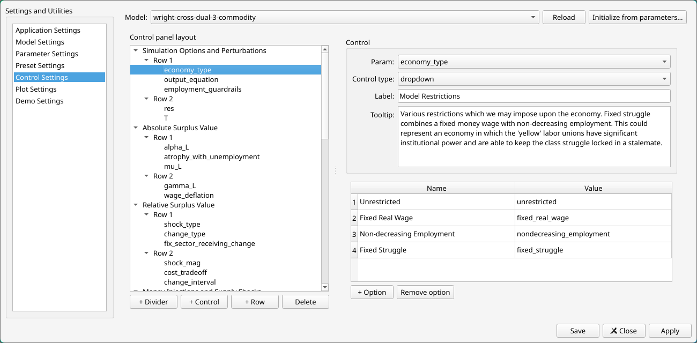
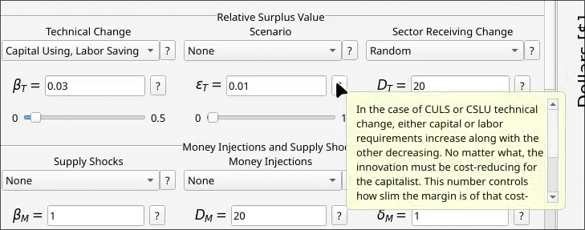
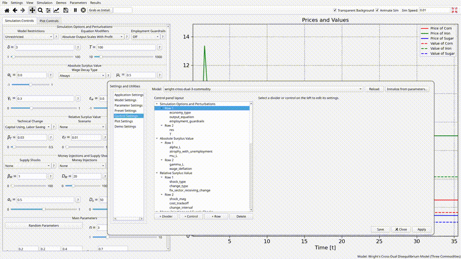
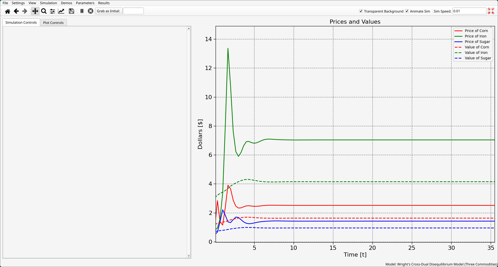
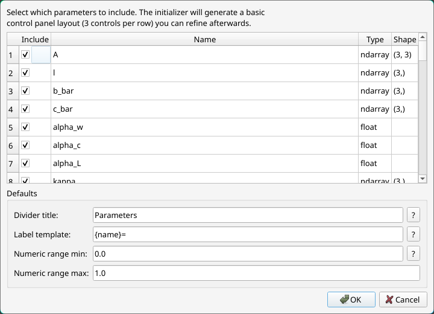
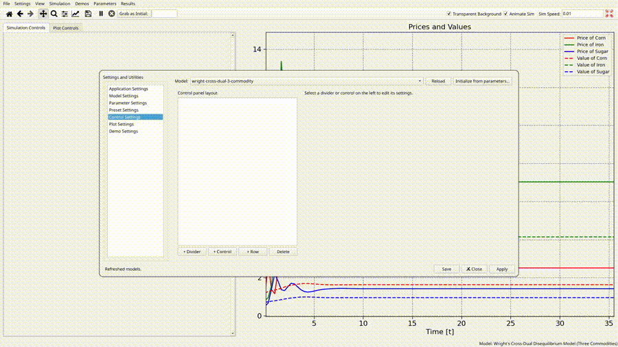
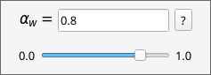
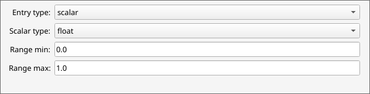

A model in Overseer is defined by a simulation function which takes a set of parameters as input, and which exhibits different behavior depending on the values of those parameters. The primary role of the control panel is to allow you to create [widgets](https://en.wikipedia.org/wiki/Graphical_widget) which allow you to adjust these values and rerun your model to see the effects. In this section, we will go into detail on all of the things you can build in a control panel. Note that this section is specifically focused on the simulation controls tab of the control panel. For more information on the plot controls tab, see [the section on the anatomy of Overseer section](3%20-%20Anatomy%20of%20Overseer%20-%20The%20Control%20and%20Graph%20Panels).

The control settings tab allows you to edit the controls which you see in the control panel:



Like the plot settings tab and the `plotting_data.yml` file, the control settings tab targets a single specific file of your model folder - `control_panel_data.yml`, found in the `data` folder of your model directory. Also similarly, this is a yaml file, meaning it is very easy to simply edit manually if you would rather do that than work with the GUI interface.

# Common Widget Properties
All widgets (minus buttons) have a few things in common:
1. They are assumed to correspond with a specific *single* parameter of your system. This is not a one-to-one correspondence - you can have parameters without control panel widgets, or multiple control panel widgets for a single parameter. 
2. They have a label field used to identify what they control in the panel. For entry widgets specifically, LaTeX names are allowed. So if your parameter is $\epsilon$, you can make the Greek letter appear as a label by writing in \$\epsilon\$. Again to emphasize, this is currently only supported for entry widgets specifically.  
3. They all have a ? button next to them which can be clicked or hovered over to show the user additional information about what they control. What appears in the tooltip is controlled by the Tooltip field of the widget settings. This is very useful and highly recommended if you are creating anything meant for demonstrative or educational purposes. **Latex math mode is allowed in these tooltips!** Just wrap whatever math you want to write in dollar signs $. 


# Organization
## Rows
Widgets in the control panel are organized into vertically stacked rows. If we create a new row, widgets which are put inside of that row will arrange themselves from left to right. You can have as many widgets as you want in a row, but a good rule of thumb is to have two or three. 
## Dividers
Multiple rows of control widgets which have a related role within your model can be grouped together under a section, demarcated by dividers. In the example above, we see widgets organized into the sections "Simulation Options and Perturbations", "Absolute Surplus Value", and "Relative Surplus Value", which gives a control panel which looks like this:


These section dividers are purely visual. They do nothing at all besides adding a horizontal divider with a name in between two rows. But they do a good job organizing the user's attention and understanding. 
## Reordering
All of these elements - widgets, rows and dividers, can be seen as elements within a tree structure inside of the control settings tab. Rows appear inside of a divider category, and widgets appear inside of rows. Any of these elements can clicked and dragged in order easily rearrange them:



However, the reader should be warned that this feature is a little wonky at the time of writing this. Sometimes, if you drag the widgets around and don't keep them carefully indented where they are supposed to be, they disappear and delete themselves. This deletion isn't permanent unless you click apply or save, so if it happens you can simply close and reopen the settings menu to recover. However, it means that you should always save whatever settings you've changed before doing this. 
# The Panel Creation Wizard
As shown off in the [the quick-start tutorial](1%20-%20Quick-Start%20Tutorial%20--%20Building%20a%20Model%20From%20Scratch.md), the control settings tab has a built-in wizard which can instantly bootstrap a serviceable control panel from scratch, provided you've already defined your parameters. As an example using the [Ian Wright cross-dual disequilibrium model found in the examples](https://github.com/alexbcreiner0/Overseer/tree/main/src/overseer/defaults/models/wright-cross-dual-3-commodity), I've temporarily deleted the entire `control_panel.yml` file, so we currently have nothing:



If we open up the control settings tab and click the "Initialize from parameters" button on the top right where the model is selected, we will be shown a new window:



Here you are given a few final choices to sign off on before the panel is created. In order from top to bottom:
1. You can uncheck any parameters that you don't want included.
2. Divider title: This is a name for a divider which appears at the very top of the control panel, which I find looks nice. Defaults to "Parameters". 
3. Label template: This is how labels will be created for each parameter. {name} is a placeholder which will be replaced with whatever the name of the parameter is. So by default, labels will be the name of your parameter, followed by an equal sign. (At the time of writing, this only applies to entry widgets. The equal sign is ignored for labels of dropdown and checkbox widgets.)
4. Numeric range min/max: For entry-widgets, this is the upper and lower bound for what the slider can go between. Some post-creation tweaking is inevitable here, so just either pick a range that works most generically for any numbers in your simulation or ignore it and change the numbers for individual widgets later. 

The defaults for these are pretty sensible, so most of the time I just completely ignore this window and blindly press Ok. After doing this and applying the changes, we get the following control panel:



Not too shabby! Obviously there is a lot of cleanup to do, but this can save you a lot of time and act as an effective jumping-off point. Two things to note about what the wizard did here:

1. It inferred the type of widget you want from the parameter type. Specifically, it first looks at the *type hints* of the `parameters.py` file. To make sure that the type hints are accurate, it also tries to instantiate your dataclass using the defaults provided along with anything usable it can find in the `params.yml` file, and uses those types as the authoritative ones if it can. But since type hints are required for defining a dataclass, it always has these to fall back on.
2. Widgets are created in rows of three. Depending on what the types were, this could look perfect or terrible. 

That's all there is to say about creating control widgets in general. Let's now turn to discussing the different individual widget types. 

# Widget Types
For the most part, there is a specific widget for each different type of parameter. You are free to make a checkbox for a matrix parameter - Overseer will not stop you - but this will lead you to simulation errors when Overseer tries to pass a `bool` value to the dataclass as the input for that matrix. 
## Entry Blocks
Entry blocks are the workhorse widget type of the control panel. Really, entry-block is just the umbrella term for several related types of widgets. There are **scalar** entry blocks, **vector** entry blocks, and **matrix** entry blocks.
### Scalar Entry Blocks
These are the go-to control panel widget for parameters which are a single number, regardless of whether that number is an `int` or a `float`. An entry-block consists of an text-entry widget where you can write the number manually, as well as a slider underneath that allows you to adjust it by feel. 



All types of entry blocks support LaTeX labels, and tend to look very good when defined in the form $var=$, since the text edit widget will appear right after the equal sign. There isn't much to specify here as far as options go. Just tell Overseer whether it is a float or an int, and what the minimum and maximum is for the slider. Make sure that the scalar type matches your parameter! 



###  Vector Entry Blocks
These are 

## Dropdowns
Dropdowns are meant for string parameters. For example, choosing from one of several qualitative mode descriptors. 

Dividers are just meant to separate out groups of controls. The essential settings for each widget are the `control_type` which specifies what kind of widget you're making, and the `param_name`, which is which parameter (defined in your `parameters.py` file) the widget is expected to be wired to. The currently available control types are:
- `"dropdown"`: Good for qualitative parameters, such as strings or Booleans (sorry, no checkboxes right now)
- `"entry_block"`: Meant for numerical parameters, which **includes vectors and matrices**. See below for more info. Most of your widgets will be these.
- `"button_group`": Sets of buttons which execute functions related to your system. Limited functionality right now, see below for more info.

In more detail now:
### entry_block
An example entry block:
```yaml
  supply_shock_mag:
    control_type: "entry_block"
    param_name: "supply_shock_mag"
    label: '$\alpha_s = $'
    type: "scalar"
    range: [0, 1]
    scalar_type: "float"
    tooltip: "Controls the magnitude of the supply shocks."
```
Explanation: `control_type`, `param_name` and `tooltip` we already have mentioned. The other specific settings to the entry block widget are
- label: Exactly what it sounds like. Note that LaTeX is supported (use single-quotes). What would be displayed here is $\alpha_s = $ followed by an entry where the user can type values for the parameter.
- type: Should be either `"scalar"`, `"vector"`, or `"matrix"`. Depending on which of these is picked, different extra settings are expected.     
    - If it is a scalar, then additionally the application expects
        - range: For scalars, a slider is created. This range defines the left and right extremes of that slider
        - scalar_type: Self explanatory. Can be `"float"` or `"int"`
    - If it is a vector or a matrix, then additionally the application expects
        - dim: In the case of a vector, should be a single integer representing the dimension of the vector. Entries for each coordinate will be created as a column of text entries. In the case of a matrix, should be a pair of the form `[n,m]` where n and m are integers. What will be created is an $n \times m$ grid of text entries for each entry of the matrix.

### dropdown
An example of a dropdown:
```yaml
  economy_type:
    control_type: "dropdown"
    param_name: "economy_type"
    label: "Model Restrictions"
    names: ["Unrestricted", "Fixed Real Wage", "Non-decreasing Employment", "Fixed Struggle"]
    values: ["unrestricted", "fixed_real_wage", "nondecreasing_employment", "fixed_struggle"]
    tooltip: "Various restrictions which we may impose upon the economy. Fixed struggle combines a fixed money wage with non-decreasing employment. This could represent an economy in which the 'yellow' labor unions have significant institutional power and are able to keep the class struggle locked in a stalemate."
```
- For these widgets, the extra settings besides `control_type`, `param_name` and `tooltip` are:
    - label: What text gets displayed above the dropdown. LaTeX not supported currently.
    - names: The text options which the user will see
    - values: If the $i^{th}$ name is chosen in the dropdown, then the $i^{th}$ value of this list is what the application will set the parameter equal to. (So if this is supposed to be a Boolean, make sure that the associated values are `True` or `False` (no quotes).  

### button_group
This one is a little undercooked right now, but are perfectly usable within their currently limited scope. My only use for it has an entry like this
```yaml
  generation:
    control_type: "button_group"
    names: ["Random Parameters"]
    tooltips: ["Generate random parameters. Not entirely working at present."]
    display: "horizontal"
    functions: ["random_parameters"]
```
The idea is that it will create a set of buttons which perform various functions, either arranged horizontally or vertically according to the display setting. Functions for the buttons should be created inside of a file called `extra_functions.py` inside of the simulation folder of your model directory. These functions are expected to take an instance of your parameters dataclass as input and return a new parameters dataclass as output. Names specify the text which is displayed on the button. The $i^{th}$ name will be wired to the $i^{th}$ function. 

# Plot Controls Tab
