A model in Overseer is defined by a simulation function which takes a set of parameters as input, and which exhibits different behavior depending on the values of those parameters. However, parameters in Overseer aren't *only* that. They are also your central means of *communicating* with your simulation. Through your parameters and functions you define, Overseer allows you to easily create a control panel filled with [widgets](https://en.wikipedia.org/wiki/Graphical_widget) which facilitate this communication, allowing for frictionless dialectical model interaction.

In this section, we will go into detail on all of the things you can build in a control panel. Note that this section is specifically focused on the simulation controls tab of the control panel. For more information on the plot controls tab, see [the section on the anatomy of Overseer section](3%20-%20Anatomy%20of%20Overseer%20-%20The%20Control%20and%20Graph%20Panels).

The control settings tab allows you to edit the controls which you see in the control panel:

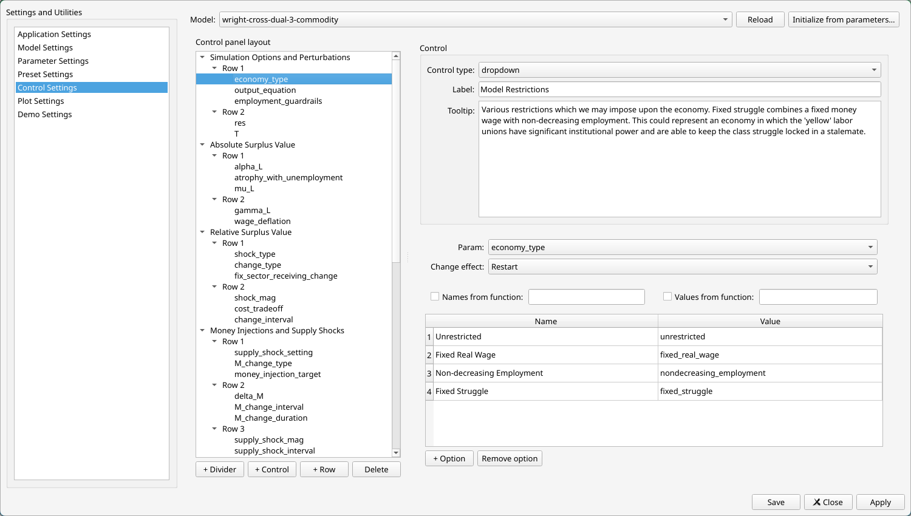

Like the plot settings tab and the `plotting_data.yml` file, the control settings tab targets a single specific file of your model folder - `control_panel_data.yml`, found in the `data` folder of your model directory. Also similarly, this is a yaml file, meaning it is very easy to simply edit manually if you would rather do that than work with the GUI interface.

# Common Widget Properties
Most widgets have a few things in common:
1. All widgets excluding buttons are assumed to correspond with a specific *single* parameter of your system. This is not a one-to-one correspondence - you can have parameters without control panel widgets, or multiple control panel widgets for a single parameter. 
2. They have a label field used to identify what they control in the panel. For *entry widgets specifically*, LaTeX names are allowed. So if your parameter is $\epsilon$, you can make the Greek letter appear as a label by writing in \$\epsilon\$.  
3. They all have a tooltip button next to them (the \[?\] button) which can be clicked or hovered over to show the user additional information about what they control. What appears in the tooltip is controlled by the Tooltip field of the widget settings. This is very useful and highly recommended if you are creating anything meant for demonstrative or educational purposes. **Latex math mode is allowed in these tooltips!** Just wrap whatever math you want to write in dollar signs $. 

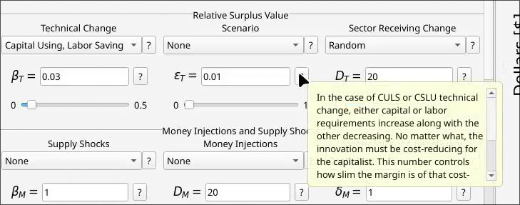
# Organization
## Rows
Widgets in the control panel are organized into vertically stacked rows. If we create a new row, widgets which are put inside of that row will arrange themselves from left to right. You can have as many widgets as you want in a row, but a good rule of thumb is to have two or three. 
## Dividers
Multiple rows of control widgets which have a related role within your model can be grouped together under a section, demarcated by dividers. In the example above, we see widgets organized into the sections "Simulation Options and Perturbations", "Absolute Surplus Value", and "Relative Surplus Value", which gives a control panel which looks like this:


These section dividers are purely visual. They do nothing at all besides adding a horizontal divider with a name in between two rows. But they do a good job organizing the user's attention and understanding. 
## Reordering
All of these elements - widgets, rows and dividers, can be seen as elements within a tree structure inside of the control settings tab. Rows appear inside of a divider category, and widgets appear inside of rows. Any of these elements can clicked and dragged in order easily rearrange them:

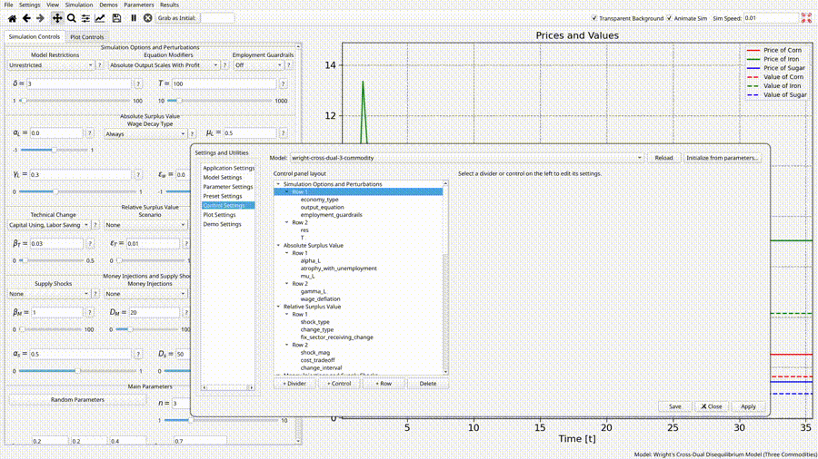

However, the reader should be warned that this feature is a little wonky at the time of writing this. Sometimes, if you drag the widgets around and don't keep them carefully indented where they are supposed to be, they disappear and delete themselves. This deletion isn't permanent unless you click apply or save, so if it happens you can simply close and reopen the settings menu to recover. However, it means that you should always save whatever settings you've changed before doing this. 
# The Panel Creation Wizard
As shown off in the [the quick-start tutorial](1%20-%20Quick-Start%20Tutorial%20--%20Building%20a%20Model%20From%20Scratch.md), the control settings tab has a built-in wizard which can instantly bootstrap a serviceable control panel from scratch, provided you've already defined your parameters. As an example using the [Ian Wright cross-dual disequilibrium model found in the examples](https://github.com/alexbcreiner0/Overseer/tree/main/src/overseer/defaults/models/wright-cross-dual-3-commodity), I've temporarily deleted the entire `control_panel.yml` file, so we currently have nothing:

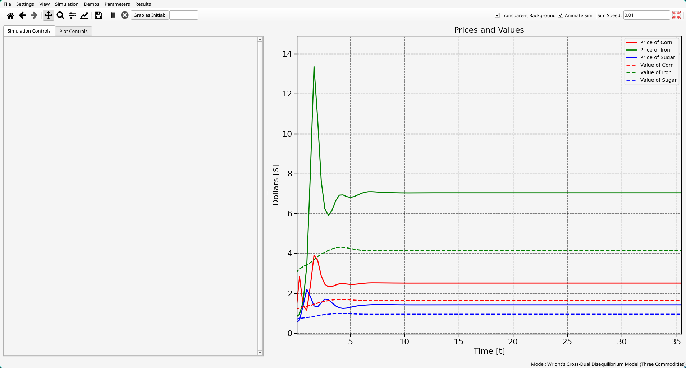

If we open up the control settings tab and click the "Initialize from parameters" button on the top right where the model is selected, we will be shown a new window:

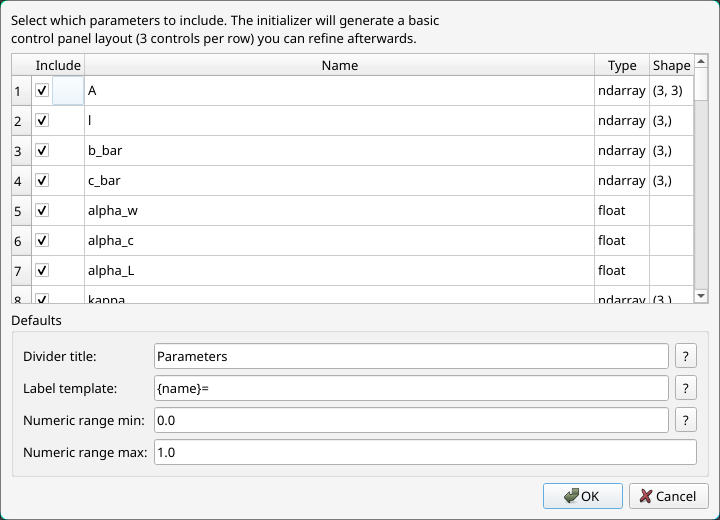

Here you are given a few final choices to sign off on before the panel is created. In order from top to bottom:
1. You can uncheck any parameters that you don't want included.
2. Divider title: This is a name for a divider which appears at the very top of the control panel, which I find looks nice. Defaults to "Parameters". 
3. Label template: This is how labels will be created for each parameter. {name} is a placeholder which will be replaced with whatever the name of the parameter is. So by default, labels will be the name of your parameter, followed by an equal sign. (At the time of writing, this only applies to entry widgets. The equal sign is ignored for labels of dropdown and checkbox widgets.)
4. Numeric range min/max: For entry-widgets, this is the upper and lower bound for what the slider can go between. Some post-creation tweaking is inevitable here, so just either pick a range that works most generically for any numbers in your simulation or ignore it and change the numbers for individual widgets later. 

The defaults for these are pretty sensible, so most of the time I just completely ignore this window and blindly press Ok. After doing this and applying the changes, we get the following control panel:

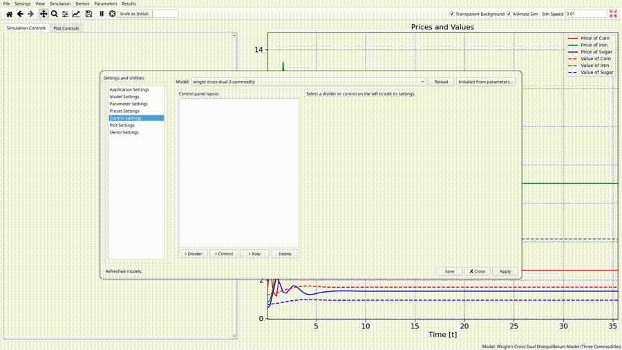

Not too shabby! Obviously there is a lot of cleanup to do, but this can save you a lot of time and act as an effective jumping-off point. Two things to note about what the wizard did here:

1. It inferred the type of widget you want from the parameter type. Specifically, it first looks at the *type hints* of the `parameters.py` file. To make sure that the type hints are accurate, it also tries to instantiate your dataclass using the defaults provided along with anything usable it can find in the `params.yml` file, and uses those types as the authoritative ones if it can. But since type hints are required for defining a dataclass, it always has these to fall back on.
2. Widgets are created in rows of three. Depending on what the types were, this could look perfect or terrible. 

That's all there is to say about creating control widgets in general. Let's now turn to discussing the different individual widget types. 

# Widget Types
For the most part, there is a specific widget for each different type of parameter. You are free to make a checkbox for a matrix parameter - Overseer will not stop you - but this will lead you to simulation errors when Overseer tries to pass a `bool` value to the dataclass as the input for that matrix. 
## Entry Blocks
Entry blocks are the workhorse widget type of the control panel. Really, entry-block is just the umbrella term for several related types of widgets. There are **scalar** entry blocks, **vector** entry blocks, and **matrix** entry blocks.
### Scalar Entry Blocks
These are the go-to control panel widget for parameters which are a single number, regardless of whether that number is an `int` or a `float`. An entry-block consists of an text-entry widget where you can write the number manually, as well as a slider underneath that allows you to adjust it by feel. 

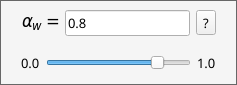

All types of entry blocks support LaTeX labels, and tend to look very good when defined in the form $var=$, since the text edit widget will appear right after the equal sign. There isn't much to specify here as far as options go. Just tell Overseer whether it is a float or an int, and what the minimum and maximum is for the slider. Make sure that the scalar type matches your parameter! 

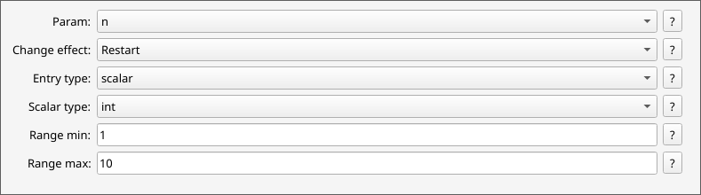

The range min and range max fields refer to the left and right boundaries of the sliders *only*. Users are still free to entry whatever numbers they would like to the text entry, which will override the slider setting. In the future, I will put a checkbox here to lock the entry block to the scalar. 

The change effect field allows you to specify on a widget-by-widget basis when a parameter should restart the simulation vs when it should send an update message instead. These preferences are only respected when the 'Parameter change response' (located in the toolbar) is set to 'Widgets decide)'. If you are a beginner, it is highly recommended to just leave this field with the default 'Restart' and not worry about it. For more information on live updating, see [here](6%20-%20Writing%20Simulations#The%20Event%20Queue%20and%20Live%20Updating).
###  Vector and Matrix Entry Blocks
Vector and matrix entries appear as multiple text entries, without any sliders accompanying them. 

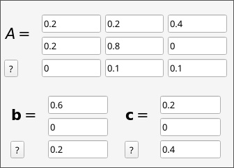

Thus the range min and range max options don't exist for those types of entries. In place of them, we now have options for controlling the dimension. 

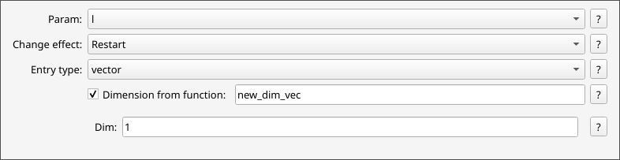

Beginners will want to leave the 'Dimension from function' row alone, and simply specify the dimension in the field beneath that as an integer (in the case of a vector) or pair of integers (in the case of a matrix). For more information about the 'Dimension from function' section above that, [see the section on metaparameters below](#Metaparameters). 
## Dropdowns
Dropdowns are mostly meant for string parameters. For example, choosing from one of several qualitative mode descriptors. However, they can also be used for Boolean values (which sometimes looks better despite checkboxes being supported.)  

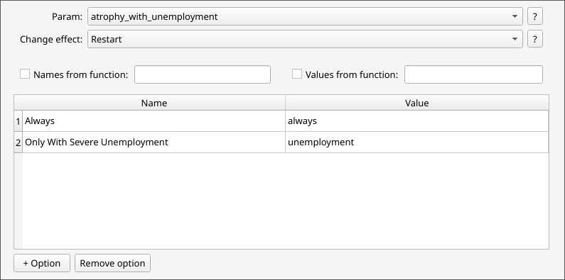

The relevant field here is the table, which allow the user to specify any number of (name, value) pairs. The name is what will appear in the dropdown, while the value is the string which will be given as the value of the parameter when that name is selected. Keep in mind that the values given from a dropdown choice are **always** strings. Thus it is up to your simulation to properly cast them as numbers if that is what is supposed to be selected.

Beginngers are advised to leave the 'Names from' fields above the table blank. For more information on the purpose of these, see the [section below on metaparameters](#Metaparameters).
## Checkboxes
Checkboxes are very simply control widgets that can allow for easy control of Boolean parameters, e.g. True/False values. There is really not much to say about these since the only fields (a parameter and a change effect) have already been mentioned for other control widget types. 
## Buttons
Buttons are a bit different than other widgets, and it took a good while for the true purpose of the button widget to reveal itself over the course of development of Overseer. Unlike all other widgets, buttons are not directly wired to a specific parameter, or any parameter for that matter. Instead, they are wired to a user-defined function. 

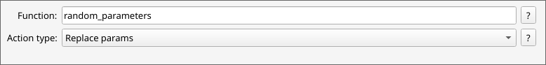

In this example case, the function name is `random_parameters`. At creation time, Overseer will look for a function by this exact name inside of an optional file called `extra_functions.py`, which should be created inside of your model's simulation directory. When pressed, Overseer will pass the function the current parameter settings along with a dataclass of relevant working directories (the latter of these will not usually be relevant, but in particular it does point towards your models directory). It will then infer how to use the output depending on the 'Action type setting'. 
#### Replace parameters
In the case of 'Replace params', Overseer will expect the function to return a new params dataclass, which it will load into the control panel. This can be useful for things like running your models with random parameter settings.
#### Example
For the [Ian Wright cross-dual disequilibrium model found in the examples](https://github.com/alexbcreiner0/Overseer/tree/main/src/overseer/defaults/models/wright-cross-dual-3-commodity), I've created a button to generate random parameters. The settings in the control panel are the ones found above. The (abridged) random parameters function inside of the `extra_functions.py` file looks like this:

```python
def random_parameters(params, env, epsilon=1e-1):
    new_params = deepcopy(params)
    # changes applied to copy...
    return new_params
```

When clicked, the new parameter settings are loaded into the control panel and the simulation restarts automatically:

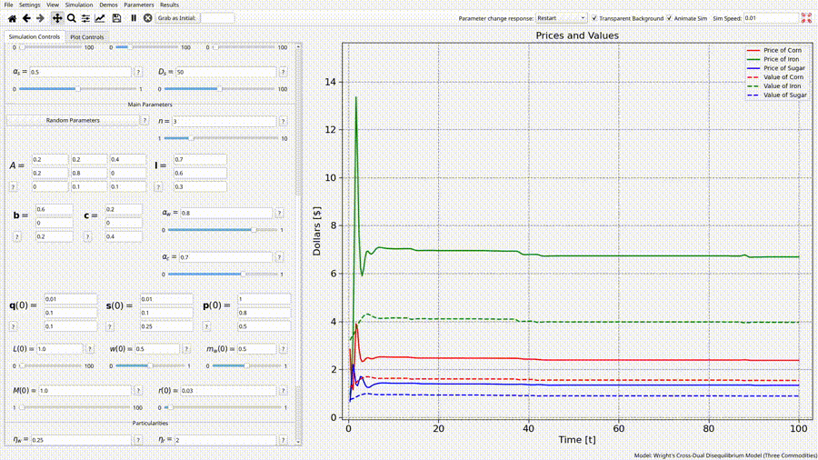

### Sim event
In the case of 'Sim event', Overseer will take whatever the output of your function is, and deposit it into the [simulation event queue](6%20-%20Writing%20Simulations#The%20Event%20Queue%20and%20Live%20Updating). It is then the responsibility of the user writing the simulation function to check and act on the data deposited into this queue. 

#### Example
In the same [Ian Wright model](https://github.com/alexbcreiner0/Overseer/tree/main/src/overseer/defaults/models/wright-cross-dual-3-commodity), I've created buttons which the user can click in order to implement 'shocks' to the economy in the form of changes to the technological state of production. The settings look like this:

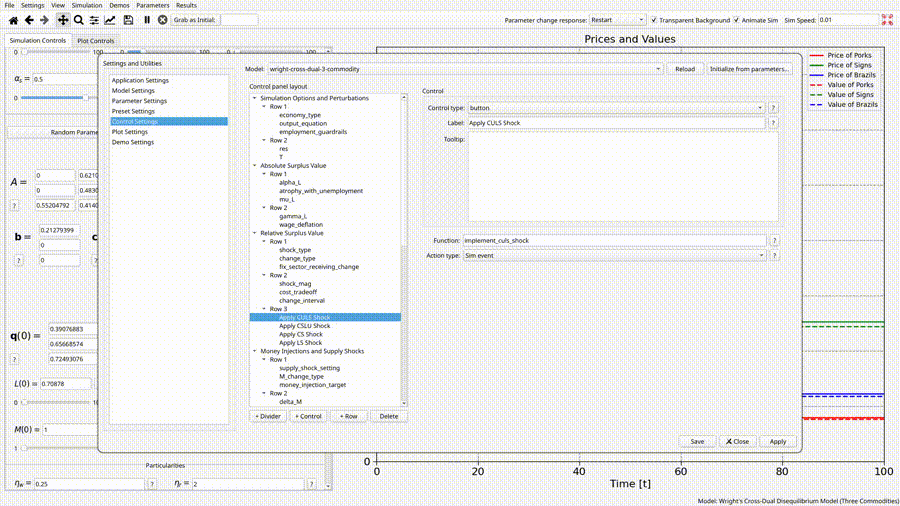

The functions (again, defined inside of a file called `extra_functions.py` in the simulation folder), look like this:

```python
def implement_culs_shock(params, env):
    return {
        "event": "shock_requested",
        "shock_type": "culs"
    }

def implement_cslu_shock(params, env):
    return {
        "event": "shock_requested",
        "shock_type": "cslu"
    }

def implement_cs_shock(params, env):
    return {
        "event": "shock_requested",
        "shock_type": "cs"
    }

def implement_ls_shock(params, env):
    return {
        "event": "shock_requested",
        "shock_type": "ls"
    }
```

The model is designed to be 'stepped' repeatedly, each step corresponding to a discrete time step. At the beginning of each time step, we check for any events:

```python
if self.event_queue is not None:
	try:
		info = self.event_queue.get_nowait()
		if info["event"] == "shock_requested":
			shock_type = info["shock_type"]
			match shock_type:
				case "culs":
					self.implement_culs_shock(
						self.params.shock_mag,
						epsilon= self.params.cost_tradeoff
					)
				case "cslu":
					self.implement_cslu_shock(
						self.params.shock_mag,
						epsilon= self.params.cost_tradeoff
					)
				case "cs":
					self.implement_cslu_shock(
						self.params.shock_mag,
						lu= False,
						epsilon= self.params.cost_tradeoff
					)
				case "ls":
					self.implement_culs_shock(
						self.params.shock_mag,
						cu= False,
						epsilon= self.params.cost_tradeoff
					)
	except queue.Empty:
		pass
```

The result:

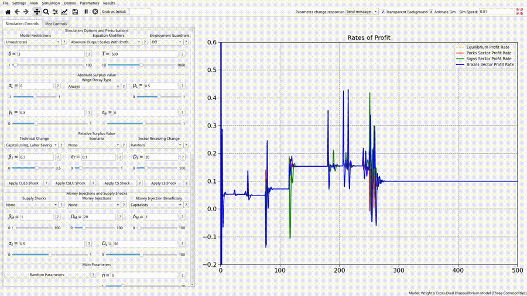

### Both?
In the future, I would also like to add a 'both' option. This would be useful, in particular, for restricting the range of sliders for scalar variables based on the current parameters, or having events which trigger changes to parameters actually feed back into the control panel. However, this is currently not available.

# Metaparameters
Sometimes, it is helpful for parameters to effect not just the simulation, but the control panel itself. For example, suppose we have an economic model which requires a fixed number of commodities to be specified, but which can be anything. Obviously the number of commodities is a parameter of the system (we'll call it $n$, but so is the [Leontief input-output matrix](https://en.wikipedia.org/wiki/Input%E2%80%93output_model) of requirements for those commodities, which has an associated matrix entry. It would be nice to have this matrix entry's dimension change automatically when the number of commodities changes. 

We call parameters which must effect not only the simulation but also the control panel itself **metaparameters**. Control panel widgets with properties that depend on metaparameters will be referred to as **metadependents**. Currently, only two control panel properties can be controlled by metaparameters - the dimension of a vector or matrix entry, and the items of a dropdown widget. More metadependents will be added in the future. 

Let's say we have a matrix parameter $A$, with a matrix entry in the control panel, representing the input-output matrix described in the paragraph above. To make the dimension of this matrix a metadependency, we simply check the 'Dimension from function' box of the widget settings, and specify a function name in place of a concrete dimension:

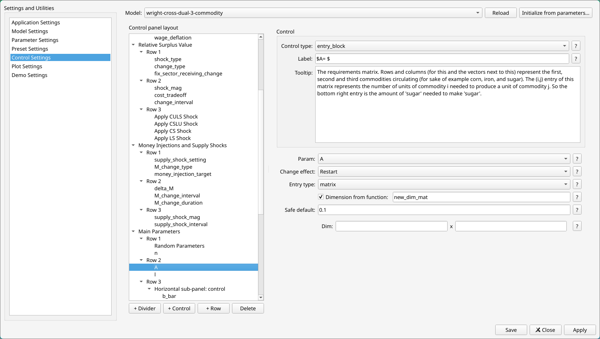

The 'Safe default' field specifies what values to set new entries to when they need to be created (i.e. when the matrix gets bigger). So when $n$ changes from, say, 3 to 4, all of the new entries created will be initially populated with 0.1.

With these settings, Overseer will now look for a function called `new_dim_mat` inside of your `extra_functions.py` file (to be placed in your model's simulation directory) in order to determine the dimension of $A$. In our case, that function simply looks like this:

```python
def new_dim_mat(params):
    return (params.n, params.n)
```

Notice that the function is given the entire `params` dataclass when this function is called. This is why there is no need to actually specify which parameter is the metaparameter the control panel settings - you as the user can decide which parameters are relevant, and use them however you like. 

In fact, Overseer is completely blind to which parameters are and aren't metaparameters. Instead, it keeps track of the widget properties which are metadependents, which it can easily recognize by the fact that we've checked the 'dimension from function' box. Whenever *any* control panel widget is altered, it will call this simple function to recalculate the dimension of $A$, and rebuild the widget if it needs to. The result:

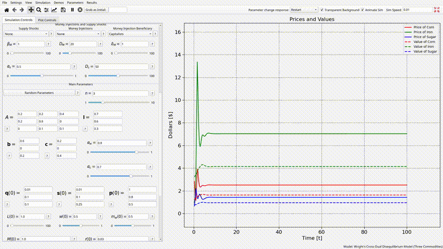

You can see that plots from the new prices automatically appear as well. This is possible because the model returns the prices as a vector trajectory - see [the section on plots and categories](7%20-%20Plots%20and%20Categories#Vector%20Plots) for more info on this feature, which is designed to work in tandem with dimensional metaparameters. You might also have noticed that new names were made up for the additional commodity types. This makes use of a plot-postprocessing feature which is described in the [plots and categories section](7%20-%20Plots%20and%20Categories#Plot%20Post-Processing). 

Matrices and vectors aren't the only widget types which depend on $n$. Above that, in the 'Relative Surplus Value' section of the control panel, we have a dropdown called 'Sector Receiving Change'. Obviously, we want these names to also be updated when $n$ changes. To do that, we use the following settings:

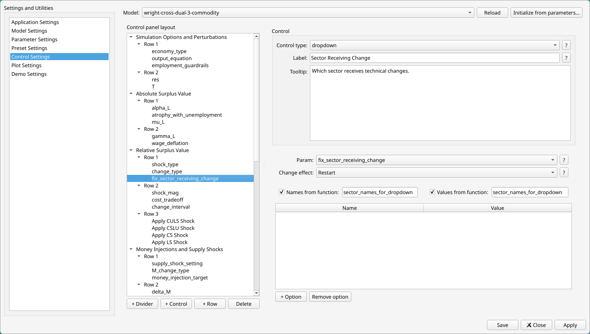

Along with the following functions:
```python
CURRENT_NAMES = ["Corn", "Iron", "Sugar"]
CURRENT_N = 3
COMMODITIES = []
root = Path(__file__).parent.parent
with open( root / "data" / "commodities.txt", "r") as f:
    for line in f:
        COMMODITIES.append(line.strip())
        
def get_new_commodities(n):
    return random.sample(COMMODITIES, n)

def sector_names_for_dropdown(params):
    global CURRENT_NAMES
    global CURRENT_N
    if params.n != CURRENT_N:
        old_n = CURRENT_N
        CURRENT_N = params.n
        if old_n > CURRENT_N:
            CURRENT_NAMES = CURRENT_NAMES[:CURRENT_N]
            return ["Random"] + CURRENT_NAMES[:CURRENT_N]
        else:
            n_new = CURRENT_N - old_n
            new_names = get_new_commodities(n_new)
            CURRENT_NAMES += new_names
            return ["Random"] + CURRENT_NAMES
    else:
        return ["Random"] + CURRENT_NAMES

def sector_vals_for_dropdown(params):
    out = [-1]
    for i in range(params.n):
        out.append(i)
    return out
```

Thus new random commodity names are drawn and added or removed according to some liberal abuse of global variables. If you were reading the example of generating random parameters above, note that the random parameter generation function, which generates new names, must keep them updated:

```python
def random_parameters(params, env, epsilon=1e-1):
    new_params = deepcopy(params)
    # changes applied to copy...
    
    global CURRENT_NAMES
    global CURRENT_N
    CURRENT_NAMES = get_new_commodities(CURRENT_N)
    
    return new_params
```

This is why it's helpful to have all of these different meta-helper functions in the same file. 

One final note about metaparameters and in relation to [live updating](6%20-%20Writing%20Simulations#The%20Event%20Queue%20and%20Live%20Updating). Obviously, having the dimension of a matrix change in the middle of a simulation is a recipe for unintended outcomes, and doesn't really make any sense to me in terms of when you might be motivated to do this. Thus **metaparameters are ineligable for live updating**. Regardless of the widget setting, and regardless of the parameter change response, **changing a metaparameter will always halt and restart the running simulation.**

## Plot Pre-Processing
Although this feature might be argued to belong in the section on plots and categories, the current state of the feature makes it hard for me to imagine any use for it besides in conjunction with metaparameters. To recap our ongoing example, we have almost finished generalizing our simulation to allow the user to change the number of commodities 'on the fly'. New plots render automatically, and widgets of the control panel are automatically mutated to reflect whatever the current value of $n$ is. 

There is only one final issue: the legend labels. Now, the label template feature goes a long way here, but only if we are satisfied with numbers representing the commodities. What if we want real names? You may have noticed a plot pre-processing dropdown in the demo settings tab:

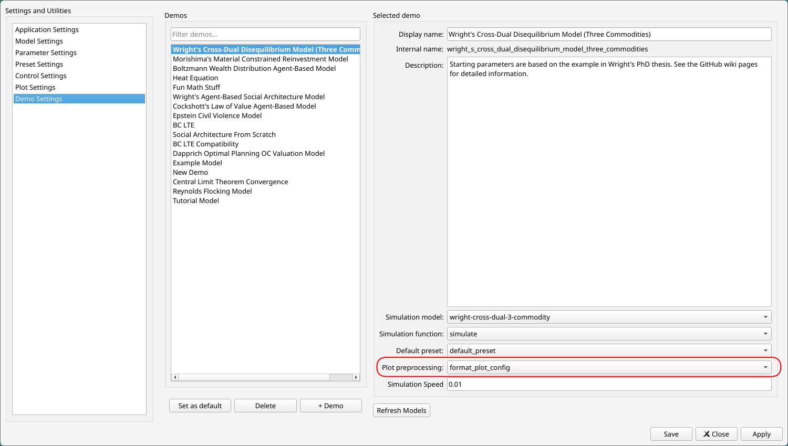

This allows you to set a function (also defined in `extra_functions.py`), which can make changes to the active plot settings prior to any rendering of plots (or running of the simulation). This function is called by the control panel *after* it's made changes to it's metadependents, but *before* emitting any parameter changes (i.e. prior to restarting the simulation). It passes the function the current `params` dataclass, but also the dictionary representing the plotting data, which it imports from your model's `plotting_data.yml` file. This will be a dictionary, whose keys are (internal) category names, and whose values are dictionaries of all relevant information for these categories (including child plots). 

The expectation is that the function called will make alterations to this dictionary, and returns the newly altered dictionary as output (I know it mutates the dictionary in place, return it anyway). That mutated dictionary will be used *instead of* the original plotting data, without altering the original data. 

The following creates explicit labels to use for it's vector plots based on the current commodity names in play. It also creates some entirely new plots in the 'Real costs' category, which specify how much of each commodity is needed to make each other commodity. 

```python
def format_plot_config(params: dict, plotting_data: dict) -> dict:
    data = deepcopy(plotting_data)
    global CURRENT_NAMES

    for _, cat_dict in data.items():
        for _, plot_dict in cat_dict.get("plots", {}).items():
            if plot_dict.get("labels"):
                if len(plot_dict["labels"]) > 1:
                    del plot_dict["labels"]
            if plot_dict.get("label_template"):
                template = plot_dict.get("label_template")
                if not template:
                    continue

                plot_dict["labels"] = [
                    template.format(*CURRENT_NAMES, i=name)
                    for name in CURRENT_NAMES
                ]
        
    real_costs_plots = data["real_costs"]["plots"]
    plots_list = [plot_name for plot_name in real_costs_plots.keys() if plot_name not in {"labor_costs", "spectral_radii"}]
    while len(plots_list) > len(CURRENT_NAMES):
        name = plots_list[-1]
        del real_costs_plots[name]
    
    while len(CURRENT_NAMES) > len(plots_list):
        next_idx = len(plots_list)
        next_name = CURRENT_NAMES[next_idx]
        plots_list.append(f"{next_name.lower()}_costs")
        real_costs_plots[f"{next_name}_costs"] = {
            "checkbox_name": f"Materials Costs of {next_name}",
            "toggled": False,
            "linestyle": "solid",
            "linewidth": 1.5,
            "labels": [f"{name} cost of {next_name}" for name in CURRENT_NAMES],
            "colors": ["red", "green", "blue"],
            "traj_key": f"a_{next_idx}"
        }

    return data
```

The result is brand new checkboxes which correctly reflect the current names of each commodity type whenever the $n$ parameter is changed:

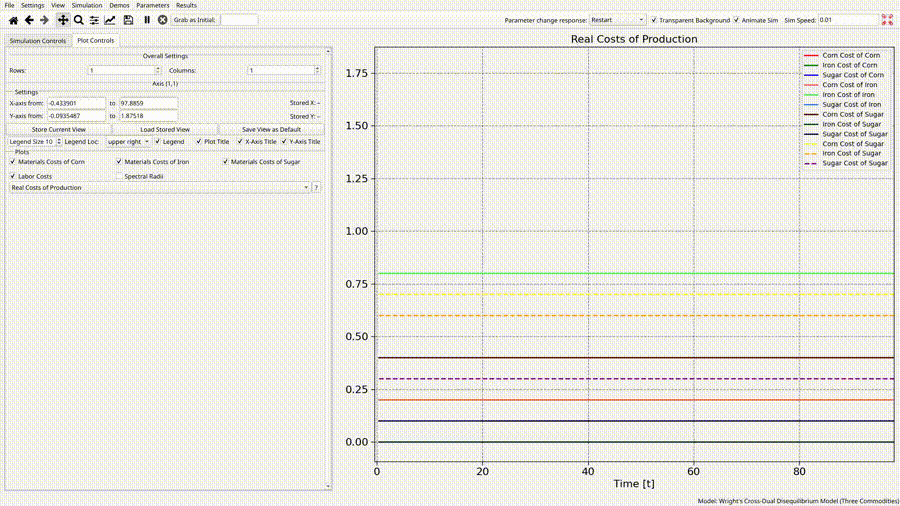

Thus, with all of Overseer's advanced features combined: metaparameters, plot pre-processing, and vector trajectories, we are able to create a model which is completely fluid with respect to the dimension of the overall system!