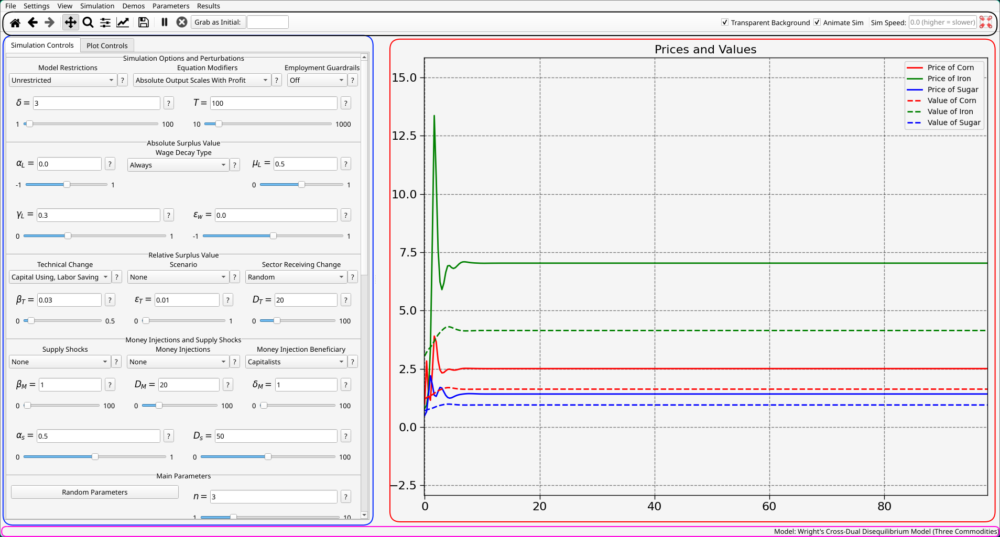
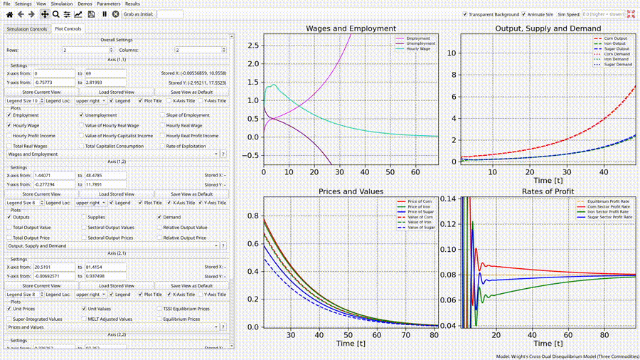

# Overview
The following picture highlights the four main components of the Overseer interface:

- **Blue**: The Control Panel
- **Red**: The Graph Panel
- Magenta: The Status Bar
- Black: The Toolbar

# The Status Bar
The status bar is the primary means that Overseer has to communicate with you. Status messages will appear occasionally in the bottom left. When needed, additional details of what the message was about can be found by interacting with the [log files of your user data](User%20Data#logs.jsonl). Aside from that, the current demo name will be displayed on the bottom right. 

# The Toolbar
The toolbar contains various tools. The first 8 of these buttons are lifted or overloaded from the [NavigationToolbar2Qt widget](https://matplotlib.org/stable/gallery/user_interfaces/embedding_in_qt_sgskip.html) that comes with PyQt6, but I'll briefly explain what they do anyway. From left to right:
- Reset original view (I almost never use this, Overseer features much better ways to save a view and reset to it.)
- Back/Forwards from views (again, these are in my opinion inferior to the settings you have access to in the control panel, see below.)
- Enable/disable panning mode. This can also be toggled using Control+P.
	- In panning mode, you can left click and drag in order to move around in a figure, and right click and drag in order to zoom in/out. Panning mode is on by default. 
	- When not in panning mode, clicking and moving the mouse will 'snap' to the nearest point on a displayed curve and display it's coordinate (similar to how Desmos works).
- Configure subplots? I think that these allow you to adjust how plots appear relative to each other. I have never made use of this.
- Edit curve, axes and image. This one gives you the ability to temporarily change things about a plot, such as the title, the appearance of a curve, or what curves appear at all. Situationally quite useful. 
- Save figure. This opens up a dialog allowing you to save the current graph panel state as an image. See the dedicated section on [saving pictures in Overseer](Saving%20Pictures,%20Presets,%20and%20Data#Pictures) for more details on saving images. 
- Pause Simulation. When paused, Overseer will sleep instead of iterating any further on the simulation function/generator. Keep in mind that Overseer has no way of pausing your simulation function itself right now. Thus, the current iteration must finish before anything will be truly 'paused'. 
- Force kill simulation. Self explanatory.
- Grab as initial. See [the dedicated section on this](Parameters%20and%20Presets#Save%20as%20Initial) for details. 
- Transparent background toggle. It is recommended to uncheck this before saving a picture, and that's why it is here.
- Animate sim. If for some reason you don't want Overseer to report incremental progress, you can uncheck this. Instead of rendering progress as it comes in, Overseer will wait until receiving a finished signal and then render the whole thing at once. This checkbox **does not effect the efficiency of your simulation in any way*** (see [Internal Operation and Efficiency](Internal%20Operation%20and%20Efficiency)). However, it can save you some system resources. Maybe. On a single core. 
- Sim Speed. Making this a higher number does not increase the speed. Rather, it adds a sleep command in between iterations over your simulation function, of the amount of time entered. You can also increment this time using the Control+= and Control+- keybindings. (That is, while holding control, press the plus or minus buttons). 
- Tight layout. This button only does something if you have the MatPlotLib figure mode set to "Tight". Can also be called by pressing F6. See further below for information on what this does exactly.

# The Control Panel and Graph Panel
The control panel currently consists of two tabs:
- The Simulation Controls tab, which you populate yourself with widgets which allow you to adjust the parameters of your model.
- The Plot Controls tab, which allows you to control what is displayed in the Graph Panel.

For more details on what you can make for the control panel, see the [dedicated page on making control widgets](Control%20Panel%20Widgets). The focus of this section will be on the graph panel and the control *in relation to it*, i.e. the Plot Controls tab.

## Slots
Matplotlib lets you use have multiple subplots in a grid layout, each showing something different. Overseer builds an interface on top of this to allow you easy control over these. We will refer to each of these as a **slot**. The first two widgets we see in the Plot Controls tab are spinboxes that allow you to change the number of slots which are visible on the Graph Panel and how they are arranged. The largest grid of slots which Overseer allows is $3\times 3$. 

Matplotlib was never designed to be used as live-exploration software in the way that Overseer uses it. Having many slots open at the same time will rapidly deteriorate performance. My recommendation is to use one or two slots at once when exploring your model, and then consider opening multiple slots later for the sake of getting a good comprehensive figure for your write-up once you already know what you are intending to show. 

## Slot Control
For each slot we have on the graph panel, we will see a set of controls for that slot on the plot controls tab of the control panel. 

You can tell which slot this widget controls via the divider at the top - in this case the slot (1,1), i.e. the top left slot. The top set of settings allows you to precisely tune visible coordinate range of a slot, save a current view for easy recovery later, or set a current view as the default for a category (see the section on [plots and categories](Plots%20and%20Categories)). Below that, we have options to change the legend size, where the legend appears, whether the legend appears at all, and whether labels for the x-axis, y-axis or title appear at all. 

Below that is a dropdown that allows you to choose what category appears in a slot. Based on that choice, checkboxes will appear for each plot in that category. (Again, see the section on [plots and categories](Plots%20and%20Categories)). 

Many of the options just mentioned can be controlled via keybindings, which can be faster and easier than using the control panel with some practice. By pressing Control+B, followed by a coordinate of a slot you want to control, you will change your **slot target** to that slot in your grid. At that point, there are keybindings for toggling the title, adjusting the legend location, changing the plots and category, and so on, and all of these will target that slot which you chose with the key combination. See [here](Controls%20and%20Keybindings#Keyboard%20Shortcuts#Axis%20Controls) for more details on this. 

## Layout Mode
Matplotlib needs to work to determine how its subplots should appear in order to maximize the use of the available space. It has two algorithms for doing this: **tight layout** and **constrained layout**. According to the matplotlib documentation, constrained layout is the newer and better way to decide layout settings. When it comes to static and unchanging layouts, they are right about this. However, Overseer allows you to dynamically alters this layout. 

The best example of the problems with constrained layout mode is to hide the control panel entirely, something which can be done with Control+K. If you have something like a $2\times2$ grid open when you do this, you will likely see a lot of empty space in between your slots:

Another place that constrained mode can cause problems is that it tends to react a little *too* dynamically sometimes, causing disorienting constant changes to the size of a slot as the simulation runs. 

Because of these problems with constrained mode, and despite it being newer and recommended, I have included tight mode as an optional setting. The main advantage of tight layout mode is that it allows you to tell it to automatically adjust itself by pressing F6, or pressing the top right button in the toolbar:

Here you can see that while in tight layout mode, weird visual bugs appear more often, but can always be dealt with via a few taps of the F6 key. 

Bottom line: if you are having issues with constrained layout mode, try playing around with tight, and making liberal use of the F6 key to readjust the slot positions. If you are having issues with tight layout mode or just sick of pressing F6 repeatedly, try switching to constrained. 