In this section we will go over all of the currently existing plotting features which Overseer has. Let's start by giving an overview of the graph panel in general. 
# Categories
In Overseer, plots are to be organized into **categories**, which are collections of plots which you may want to view plotted with one another on the same axis. In the [plot controls tab](Anatomy%20of%20Overseer%20-%20The%20Control%20and%20Graph%20Panels#The%20Control%20Panel%20and%20Graph%20Panel) of the control panel, each [slot](Anatomy%20of%20Overseer%20-%20The%20Control%20and%20Graph%20Panels#Slots) contains a dropdown which allows you to choose which category the slot is set to:

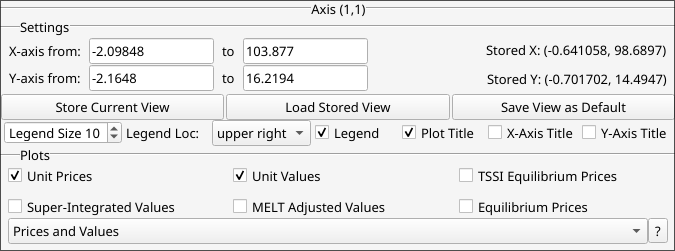

The checkboxes above the dropdown all correspond to plots which belong to the category. If we open up the plot settings tab, we can see this very clearly:

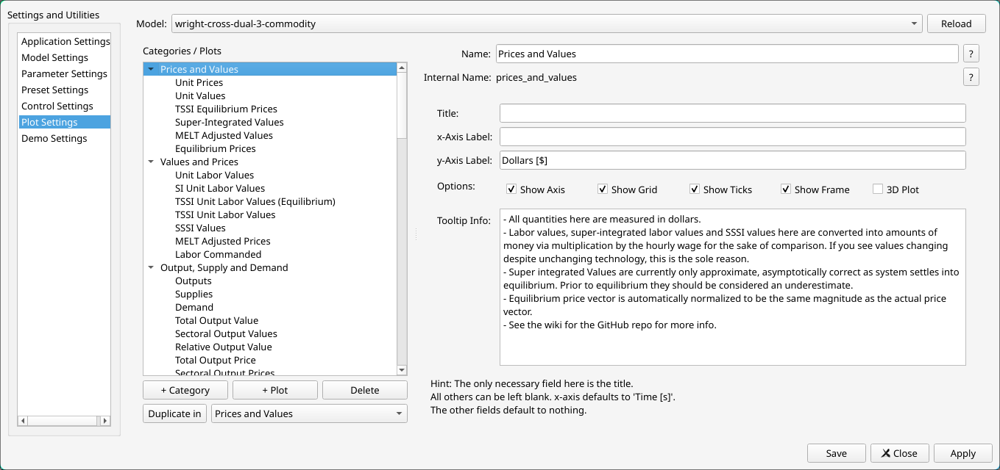

Checkboxes of a category appear in the same order that the plots appear here in the settings as child entries of the category, in rows of three from left to right. You can drag and drop plots and categories to rearrange the order of either. (The dragging is a little finicky right now. Make sure that it looks properly indented where it should be before letting go of your mouse click. If you mess up, just close and reopen the settings without clicking save or apply.)

We can see that there are a variety of settings options available for a category. These are really axis settings which apply independently of the plots. Here we can set a title, as well as labels for the x and y axes. If an x-axis label is not chosen, Time \[t\] will be displayed by default. You can avoid this by just typing a single space into the entry box here. The title and y-axis labels, if left blank, will leave no title or y-label on the plot. 

We have a variety of controls for showing various basic aspects of the subplot. It is useful to turn these off depending on what you are plotting. For example, if we were making a pie chart, it would be important to have all of these checked off. We can select whether the axis is a 2D or 3D grid as well. 

Finally, tooltip info can be used to give a viewer of your model dynamic information on the category they have selected. Users can view this information by clicking on the ? button next to the category dropdown:


# Plots
Overseer supports a wide variety of plot types. Though it will never support everything matplotlib has to offer, it aims to curate a thorough enough subset of plot types and options from that library to meet everyone's needs. Currently, it supports:
- Curves (both 2D and 3D)
- Histograms
- Scatter plots
- Heatmaps (with added support for rendering grids with discrete actors)
- Pie charts
- Vector fields
- Discrete graphs
- Surfaces in 3D

I would like to get contour plots working but I've been having trouble figuring out a system for making them look good consistently. If you look in the code there is a whole system for it, but it's not quite there yet.

Let's take a quick glance at the plot settings tab to situate ourselves:
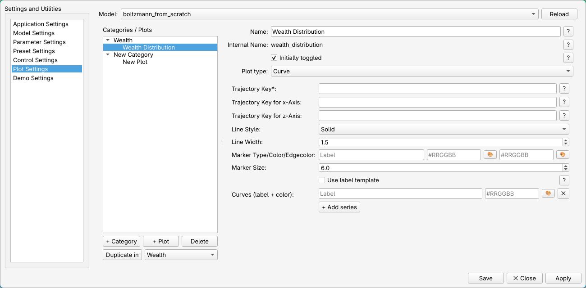

Every plot, regardless of type, has a user-facing name and an internal name. The internal name is just a more machine-friendly version of the name you give, and is computed automatically. It is worth seeing in case you wish to do any manual editing of the `plotting_data.yml` file, but otherwise can be ignored. The toggled checkbox determines whether it should appear when the user first opens up the category. 

Below that, we have the plot-type choice. The options below that depend on the plot type chosen. Many (aspirationally, all) of the options here have ? buttons which can be clicked on to provide useful info on what the setting does. Most settings for all plots are optional, or automatically set to a sensible default. Settings which are both necessary and not set to something automatically have asterisks, to denote what absolutely must be filled in. 

The options given for each plot type are a combination of settings which are specific to Overseer and settings which are just keyword arguments to matplotlib. The latter is curated, and discussion of these will be kept to a minimum, since the reader can either click the ?  box or consult matplotlib's own documentation to determine how they work (or simply experiment with them). 
## Curves
Curves are plotted using matplotlib's `plot` function. As we can see from the above, the only truly necessary setting here is the trajectory key (technically the key for the y-axis specifically). The reader who doesn't know what is meant by trajectory key should look through the [quick-start tutorial](Quick-Start%20Tutorial%20--%20Building%20a%20Model%20From%20Scratch). Generally, matplotlib requires additionally an x-axis, but as explained in the section on [writing simulations](Writing%20Simulations), the user can specify a default which Overseer will default to using. The x-axis trajectory key entry can thus be left blank *assuming* that your simulation provides this default.

The settings in between the trajectory keys and the Curves (label+color) entry are matplotlib settings, and so I will skip over those (though they should be self-explanatory). The aforementioned Curves (label+color) specifies the label which identifies the curve in the legend, and the color of the curve, respectively. (Ignore the label template checkbox and the +Add series button for the time being.) Colors can be specified in hexadecimal or by typing out the name of the color. The entry box itself will color to assure you that you've picked something valid. There is also a color picker which can be accessed by clicking the button next to the field. 

Anyone who has ever used matplotlib is no doubt aware that it refuses to plot anything if the x and y axis data it is given aren't the exact same size. Overseer has a different philosophy. In general, it will try to plot whatever it can based on what you give it. If you give a y-axis key of size 6, but your x-axis key is size 4, then it will truncate the y-axis data and plot points 0 through 4 you. **Note that this assumes that this is the correct way to pair points together. If it isn't, then you may misunderstand your own results. Be warned.**
### 3D Curves
The z-axis trajectory key can of course be left blank unless the user is trying to plot a curve in 3D. There is actually nothing wrong with plotting 2D curves on a 3D axis. If your axis is set to 3D from the category settings and you plot a 2D curve, you will just see a 2D curve which looks confined to the $z=0$ coordinate. The z-axis trajectory will be ignored *unless* the category is set to 3D. 
#### Example
```python
def curve_demo_3d(params: Params):
    a, b = params.a, params.b

    eps = 0.03
    t = 0.0

    for _ in range(1000000):
        t += eps
        traj = {
            "sine": Append(a*np.sin(b*t)),
            "cosine": Append(b*np.cos(b*t)),
            "z": Append(1/(0.01*np.sqrt(t)))
        }

        yield traj, Append(t)
```

Results in:

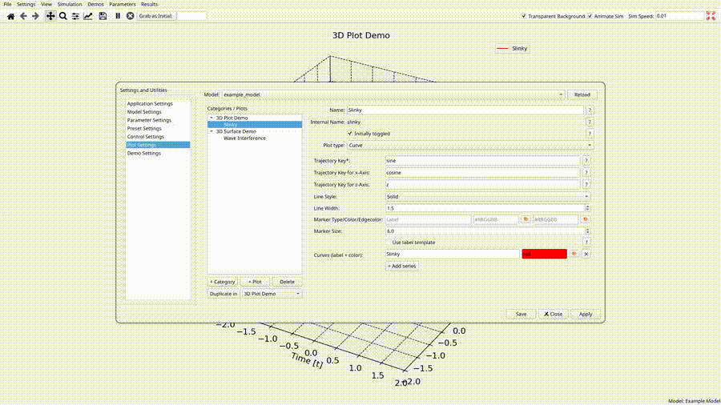

### Vector Plots
Suppose we were working with an economic model in which we had a set of prices for $n$ different commodity types, all of which were evolving over time. As a very contrived example, consider this simulation function:

```python
from .parameters import Params
from overseer.tools.dataclasses import Append, Extend, Replace
import numpy as np

def get_trajectories(params: Params):
    traj = {
        "t": Append(0),
        "prices": Append([1.5, 2.5, 3])
    }
    yield traj

    traj = {
        "t": Append(1),
        "prices": Append([3.2, 4.5, 7])
    }
    yield traj

    traj = {
        "t": Append(2),
        "prices": Append([5.2, 1.5, 5])
    }
    yield traj
```

Since we are telling Overseer to **Append** this list data, rather than **Extend** it, Overseer assumes that you are providing it with a vector trajectory, and knows how to plot all three of these scalar quantities over time without you having to create three separate plots for them. To do this, we don't really need to do anything different:
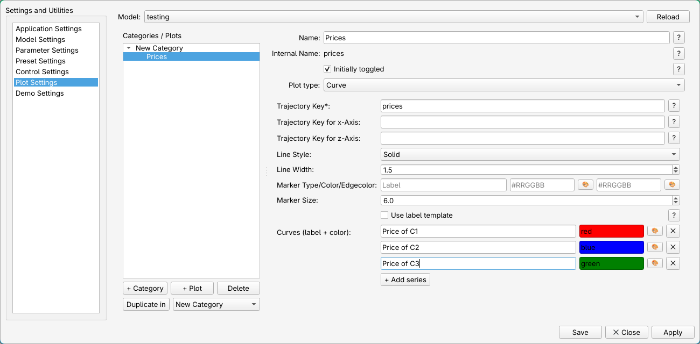
By clicking the +Add series button twice, we now have two more pairs of label+color entries, which we can use to label all three prices. The result is this:
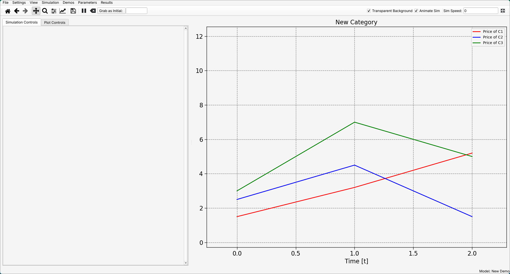
Typing out legend labels for every curve every time get get quite tiring. This is where the 'Use label template' checkbox comes into play. The following settings will produce the same results as what we just saw:

The template here substitutes every instance of {i} for whichever of the quantities is being plotted. The colors are also optional. If we left these fields blank, colors would be chosen automatically for every curve. If the number of prices was 4 instead of three, the fourth quantity would be plotted, and a color would be chosen automatically for that fourth one which is different from the first three. 
## Surfaces
Though the options are somewhat limited currently, support for surfaces is there, using matplotlib's `plot_surface` function. This function requires three arguments, all of which are 2D arrays. The idea is to define two 1D arrays, and then use numpy's `meshgrid` function to create a 2D grid defining an set of $(x,y)$ coordinates. These can then be fed into a scalar function to return all of the z-values.

#### Example
```python
def surface_frame(t):
    x = np.linspace(-5, 5, 50)
    y = np.linspace(-5, 5, 50)
    X, Y = np.meshgrid(x, y)

    x1 = 1.5 * np.cos(0.03 * t)
    y1 = 1.5 * np.sin(0.03 * t)

    x2 = 1.5 * np.cos(0.025 * t + np.pi)
    y2 = 1.5 * np.sin(0.04 * t)

    r1 = np.sqrt((X - x1)**2 + (Y - y1)**2)
    r2 = np.sqrt((X - x2)**2 + (Y - y2)**2)

    Z = (
        np.sin(5 * r1 - 0.18 * t) / (1 + 0.35 * r1)
        + np.sin(4 * r2 - 0.15 * t) / (1 + 0.35 * r2)
    )

    return X, Y, Z
```

Results in


At the time of writing this, the GUI settings are pretty lacking for these. At the moment there is only support for choosing a color map and whether or not to display the colorbar. More features will be added in the future. 

It is worth emphasizing that matplotlib is especially lacking features when it comes to updating surfaces. The only option really is to just reconstruct the entire plot every frame. So this is definitely the most taxing simulation to animate. 
## Vector Fields
Vector fields (or *quiver plots*) can be created using matplotlib's `quiver` function. This function takes as required arguments two 2D arrays, $U$ and $V$, where $(u_{ij}, v_{ij})$ is the displacement of a vector. If nothing else is specified, this vector extends from the origin. Optionally, a second pair of 2D arrays $X$ and $Y$ can be specified, where $(x_{ij}, y_{ij})$ denotes where that same vector extends from instead of the origin. 

At present, there isn't much to specify to Overseer besides these keys. A color map can be specified to color the vectors, and a fifth 2D array $C$ can be given to guide the coloring process, where $c_{ij}$ specifies the color magnitude of that vector.

A color bar can be toggled, but fair warning: this colorbar **DOES NOT WORK unless Overseer's figure mode has been set to constrained.** Even if that is the case, the colorbar does not seem to play very well with animations. I'd recommend keeping it turned off until the animation is finished.

#### Example
```python
def vector_field_demo(params: Params):
    vec_x = np.arange(-10, 11, 1)
    vec_y = np.arange(-10, 11, 1)
    Xg, Yg = np.meshgrid(vec_x, vec_y, indexing="xy")

    base_U = -Yg.astype(float)
    print(f"{base_U=}")
    base_V = Xg.astype(float)
    print(f"{base_V=}")

    traj = {
        "vec_X": Xg,
        "vec_Y": Yg
    }

    t = np.array([0.0])
    epsilon = 0.5e-2

    for _ in range(10000):
        current_t = t[-1]

        angle = 0.8 * current_t
        ca = np.cos(angle)
        sa = np.sin(angle)
        rot_U = base_U * ca - base_V * sa
        rot_V = base_U * sa + base_V * ca

        cx = 6.0 * np.cos(0.9 * current_t)
        cy = 6.0 * np.sin(1.2 * current_t)

        sigma_env = 2.2
        env = np.exp(-((Xg - cx) ** 2 + (Yg - cy) ** 2) / (2 * sigma_env**2))
        env = np.where(env > 0.18, env, 0.0)

        pulse = 0.5 * (1.0 + np.sin(3.0 * current_t))
        amp = env * pulse

        vec_U = amp * rot_U
        vec_V = amp * rot_V

        traj["vec_U"] = vec_U
        traj["vec_V"] = vec_V

        traj["vec_C"] = np.absolute(vec_U + vec_V)

        yield traj, t

        t = np.append(t, t[-1]+epsilon)
```

Results in:


## Scatter Plots
Scatter plots work much the same as curves. Only a y-axis key needs to be given, and Overseer will default in the absence of one to either a returned t-value or a "t" key in the output dictionary of your simulation. A z-axis key will be ignored if the category settings don't tell Overseer that the plot is 3D, and 2D plots can easily render in a 3D space. In the case that they do not match, data of the larger sets will be truncated, so that matplotlib does not raise errors.

The matplotlib `scatter` command accepts as marker size a single number or a list of numbers specifying the size of each individual point. The same goes for color. Let's take a look at the rest of the settings:


Here, I've given a trajectory key name to both the Marker size and Color entries in these settings. I've also checked both of the boxes above this, to specify that these are to be interpreted as trajectory keys. If the "Size value is trajectory key" is not checked, then it is expected that Marker size is an integer. Likewise, if "Color value is trajectory key" is not checked, then the color entry is expected to be a color.

The main place in which scatter plots differ from curves in Overseer right now is that vector trajectory plots for scatter plots are currently not supported. I have not seen a reason to bother. If you have a reason, make an issue and explain the use-case.

#### Example
Let's just do a silly modification of our curve demo example:
```python
def scatter_demo_3d(params: Params):
    a, b = params.a, params.b

    eps = 0.03
    t = 0.0

    for _ in range(1000000):
        t += eps
        traj = {
            "sine": Append(a*np.sin(b*t)),
            "cosine": Append(b*np.cos(b*t)),
            "z": Append(1/(0.01*np.sqrt(t))),
            "color": Append(f"#{random.randint(0, 0xFFFFFF):06x}"),
            "size": Append(random.randint(1,300))
        }

        yield traj, Append(t)
```

With the settings above, this gives the following output in Overseer:

## Histograms
Taking a look at the histogram settings we see a list of options which should be fairly self-explanatory if you are familiar with making histograms in matplotlib:


The only required setting here is the data key. If the bins key is left blank, then Overseer will attempt to construct bins for you. To determine the bins, it looks at the number of unique data points you have, and goes with that, capping the number of bins at 200. It then creates the bins by calling Numpy's [histogram_bin_edges](https://numpy.org/doc/stable/reference/generated/numpy.histogram_bin_edges.html) function and giving it this number along with the data. 

In matplotlib, each histogram bin is a unique artist in the plot, which lends itself decently well to live updating. Overseer tries to avoid rebuilding your histogram every yield unless the number of bins or locations of those bins changes. If it doesn't change, then Overseer merely updates the heights of each of those rectangles, which saves a bit of compute. 

Weights are ignored unless a weight key is specified. For details on how do construct weights, see the matplotlib documentation. Same for all of the other options up to the Label/Color/Edgecolor section.

Firstly, you can see from the "+Add series" button that vector plotting is available for histograms. This works identically to the feature for curves: If your data key points to a list of vectors, all of size $n$, then Overseer will create a distinct histogram of a different color for each *entry* of the data. So there will be a histogram whose data is the set of all *first* entries of each vector, another whose data is all *second* entries, and so on.

Colors, or the first several colors, can be explicitly specified, but below that we can also see a Gradient option, which allows you to instead use a color map to make taller rectangles brighter colors compared to shorter ones etcetera. *If gradient is set to anything other than none, it will override any facecolors that you set.* Edgecolors on the other hand can still be set with a gradient.
#### Example
This example comes from my reconstruction of Ian Wright's [capitalist social architecture model](https://arxiv.org/abs/cond-mat/0401053), the code of which can be found [here](https://github.com/alexbcreiner0/Overseer/tree/main/src/overseer/defaults/models/wright_agent_based_social_architecture). The first category demonstrates the distribution of each social role (capotalist, worker, or unemployed) over the whole course of the simulation:
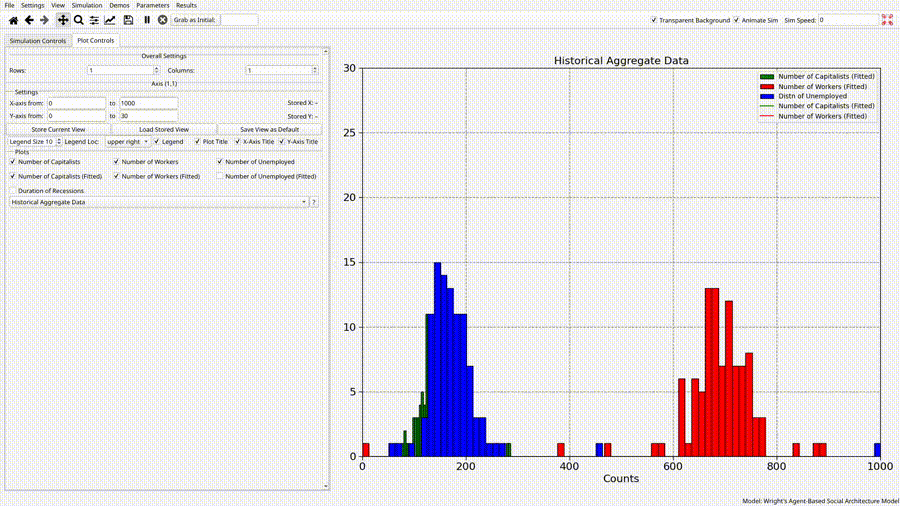

## Pie Charts
Matplotlib's demands for making pie charts were a little odd to me, so more stuff is handled by Overseer than for the other plots. The settings menu just has three entries:
1. Data key: A key pointing to the raw data. Matplotlib wants counts of the unique data points, but I found that counterintuitive, so Overseer handles that automatically. You give it the same thing you would give it to make something like a histogram. 
2. Color mapping key: A key pointing to a dictionary which maps specific data points to colors (in hexadecimal or string names). Data points which are missing from this dictionary are *ignored*. Technically optional but why would you not have this.
3. Label mapping key: A key pointing to a dictionary which maps specific data points to labels for use in the legend. Optional. 

Pie charts in matplotlib *do* appear in the same axes as any other plots, specifically in the square box from -1 to 1 for both the x and y axes. However, the normal axis decorations only get in the way. Because of this, pie chart plots should usually appear in their own specific category, and in the category settings we should make sure to turn off every decoration:

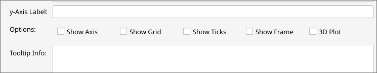
#### Example
In the [Epstein Civil Violence](https://doi.org/10.1073/pnas.092080199) model, we have two kinds of agents: citizens and cops, moving around randomly on a 2D grid. Citizens are at any moment in one of three states - quiet, active, and jailed. Quiet citizens will periodically go active (at a rate determined by some fun sounding constants like regime legitimacy and general grievance level) based on a risk assessment: the fewer cops there are nearby, and the more already active agents are nearby, the more likely they are to go active. The full model is available as an example [here](https://github.com/alexbcreiner0/Overseer/tree/main/src/overseer/defaults/models/epstein_civil_violence). (Credit to the [mesa](https://mesa.readthedocs.io/latest/examples/advanced/epstein_civil_violence.html) library documentation, who include this as an example and whose code I mostly lifted from for this.

To get a live pie-chart of the distribution of citizen states at a given moment during the simulation, we assign numbers to each state. Say 1 means active, 2 means quiet, and 3 means arrested. The trajectory with everything irrelevant chopped out would look like this:

```python
from .parameters import Params
import numpy as np
from .Model import EpsteinModel
from overseer.tools.dataclasses import Replace, Extend, Append

def get_trajectories(params: Params):
    model = EpsteinModel(params)
    T = params.T

    traj = {
        "states": model.get_agent_states(),
        "pie_color_map": {1: "#D73229", 2: "#A2D392", 3: "#565656"},
        "pie_label_map": {1: "Active", 2: "Quiet", 3: "Arrested"}
    }
    t = np.array([0])

    yield traj, t

    for i in range(T):
        model.step()

        traj["states"] = Replace(model.get_agent_states())
        t = np.append(t, i)
        if i % 100 == 0:
            model.get_agent_states_lazy() # I don't remember the deal with this.
        yield dict(traj), t.copy()
```

The result:

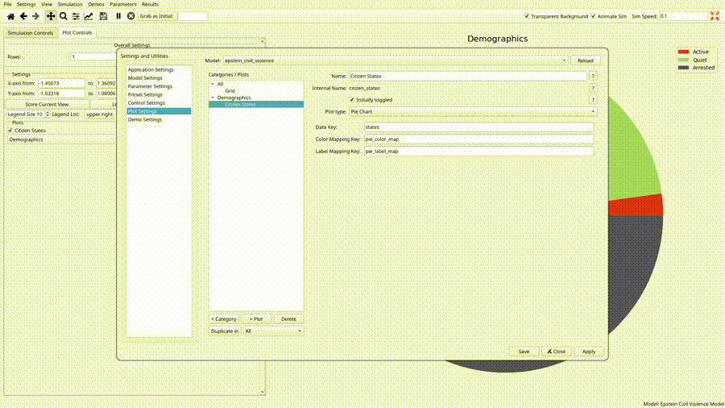

## 'Heatmaps' (Images)
The "Heatmaps" category in Overseer primarily utilizes matplotlibs extremely versatile `imshow` function. To start out, let's observe the options menu:


The thing I'd like to direct our attention to here first is the Type field. There are two main use-cases that I have in mind for plots falling under these settings:

1. Rendering heatmaps in the conventional sense. These don't have to be discretized renderings of continuous spaces, but nonetheles I've chosen to denoting the type associated with this use-case Continuous
2. Rendering discrete grids where, for example, agents can move around on them. This is the Discrete type.

Different options appear underneath depending on the type. The discrete case is different because, in addition to needing to color the cells, there is the additional need of plotting objects *inside* of the cells. There are streamlined options for doing this, which make special use of matplotlib's `scatter` function.

There is really nothing here that does not have a direct correspondence to the arguments you would give to matplotlib's `imshow` function in this case. The primary thing that `imshow` needs is a piece of image data, which the "Trajectory key" field refers to. This can be any of the following:

1. 2D, or scalar data. I.e. an $m \times n$ array for some $m,n\in \mathbf{N}$. 
2. RGB Data. This is an $m\times n$ array like the above, but each entry is a triplet of numbers representing the red, green and blue values for that cell. So if it were a Numpy array, the shape would be $(m,n,3)$. 
3. RGBA Data. Same thing, but with a fourth alpha entry (transparency).
4. A Pillow Image instance. 

Overseer accepts all of these, but will reject anything besides 2D scalar data for certain applications. You must not use [the Append or Extend dataclasses](Writing%20Simulations#Extend%20Append%20and%20Replace) when you are serving this data to Overseer - the new image being yielded must always take the place of the old one in its entirety. 

For 2D scalar data, the idea is to color the cells of an $(m,n)$ grid according to some mapping from the scalar numbers to colors. This gives you a heatmap. It is specifically here with the interpretation of scalar data that the distinction between discrete and continuous has relevance. With continuous chosen as the type, the expectation is that cell coloring is to be done automatically for these via one of matplotlib's color mapping algorithms. (See the example below.) The discrete menu is simply a single dropdown - just choose your colormap and forget about it.

For 'discrete' data, the expectation is that you are providing an explicit mapping from values to colors *yourself*. Essentially, the grid is implicit to the shape of what you are returning, and each cell represents a discrete state. Often, especially in agent based models, the state of a cell corresponds to the actor (or actors) inside of the cell. Because of this, the menu gives you the additional option of adding markers inside of the colored cells using an additional call to matplotlib's `scatter` function. 

When discrete is selected as the type, the first row allows you to specify a key corresponding to a list containing all unique scalar data points, the second asks you to specify a key corresponding to a list of colors, where the $i^{th}$ color in the colors list is what the $i^{th}$ value of a cell should appear as, and an optional list of labels to appear in the legend. 

Below that, we can optionally declare any number of markers to be placed inside of cells based on the value, on top of the cell's background color. From left to right, you declare the value, the size of the marker, a name for the 'thing' in the marker to be displayed in the legend, and then below that the marker itself (anything which would be valid as the marker argument for `scatter`), the facecolor of the marker, and the edgecolor of the marker. 

What was just said is better illustrated with examples, but before that we should briefly mention how Overseer handles RGB, RGBA and Pil Image data. The short answer is that it doesn't really care about them one way or the other. There is no color mapping to be done here because the colors are specified within the data itself. Thus any choice of color map in the continuous case or explicit color values in the discrete case will be ignored. Furthermore, any attempt to make use of the discrete marker system will result in errors. 
#### Continuous Example
I haven't had my own use for this yet, so this is very proof of concept, but here is a blatantly vibe coded model for the heat equation evolution of a Gaussian blob:

```python
def cts_heatmap_demo(params):
    traj = {}
    t = [0.0]
    res, T = 3, 100
    nx, ny = 120, 80
    Lx, Ly = 1.0, 1.0
    dx, dy = Lx/(nx-1), Ly/(ny-1)

    L = laplacian_2d_dirichlet_sparse(nx, ny, dx, dy)

    x = np.linspace(0, Lx, nx)
    y = np.linspace(0, Ly, ny)

    X, Y = np.meshgrid(x,y)
    alpha = 0.01

    rng = np.random.default_rng(seed= None) 

    x0 = rng.uniform(0.0, Lx)
    y0 = rng.uniform(0.0, Ly)

    sigma_x = rng.uniform(0.03*Lx, 0.15*Lx)
    sigma_y = rng.uniform(0.03*Ly, 0.15*Ly)

    A = rng.uniform(0.5, 2.0)
    B = 0.0

    u = gaussian_blob(X, Y, x0=x0, y0=y0, sigma_x=sigma_x, sigma_y=sigma_y, A=A, B=B)

    traj = {
        "u": Replace(u)
    }

    yield traj

    current_t = 0.0
    for i in range(T):
        t_eval = np.linspace(current_t, current_t+1, res+1)[1:]
        new_t, new_u, sol = solve_heat_dirichlet_sparse(u, x, y, t_eval= t_eval, L= L, alpha= alpha)
        
        m = sol.y.shape[1]
        for i in range(m):
            current_t = new_t[i]
            u = new_u[i]
            traj["u"] = Replace(u)
            t.append(current_t)

            yield dict(traj), t.copy()

    yield dict(traj), t.copy()

def gaussian_blob(X, Y, *, x0, y0, sigma_x, sigma_y, A=10.0, B=0.0):
    return B + A * np.exp(-(((X - x0)**2) / (2*sigma_x**2) + ((Y - y0)**2) / (2*sigma_y**2)))

def laplacian_2d_dirichlet_sparse(nx: int, ny: int, dx: float, dy: float) -> sp.csr_matrix:
    nx_i = nx - 2
    ny_i = ny - 2
    if nx_i <= 0 or ny_i <= 0:
        raise ValueError("Grid too small for interior unknowns.")

    ex = np.ones(nx_i)
    ey = np.ones(ny_i)

    Tx = sp.diags([ex, -2 * ex, ex], [-1, 0, 1], shape=(nx_i, nx_i), format="csr") / (dx * dx)
    Ty = sp.diags([ey, -2 * ey, ey], [-1, 0, 1], shape=(ny_i, ny_i), format="csr") / (dy * dy)

    L = sp.kron(sp.eye(ny_i, format="csr"), Tx, format="csr") + sp.kron(Ty, sp.eye(nx_i, format="csr"), format="csr")
    return L

def solve_heat_dirichlet_sparse(u0_full, x, y, t_eval, L, alpha=0.01,
                                method="BDF", rtol=1e-6, atol=1e-8):
    ny, nx = u0_full.shape
    u0 = u0_full[1:-1, 1:-1].ravel()
    def rhs(t, yy):
        return alpha * (L @ yy)

    jac_sparsity = (L != 0).astype(int)
    t_span = (float(t_eval[0]), float(t_eval[-1]))

    max_step = float(t_eval[1] - t_eval[0]) if len(t_eval) > 1 else np.inf

    sol = solve_ivp(
        fun=rhs,
        t_span=t_span,
        y0=u0,
        t_eval=t_eval,
        method=method,
        rtol=rtol,
        atol=atol,
        jac_sparsity=jac_sparsity,
        max_step=max_step,
    )

    U = np.zeros((len(sol.t), ny, nx), dtype=float)
    for k in range(len(sol.t)):
        U[k, :, :] = u0_full 
        U[k, 1:-1, 1:-1] = sol.y[:, k].reshape(ny - 2, nx - 2)

    return sol.t, U, sol
```

With the following settings:

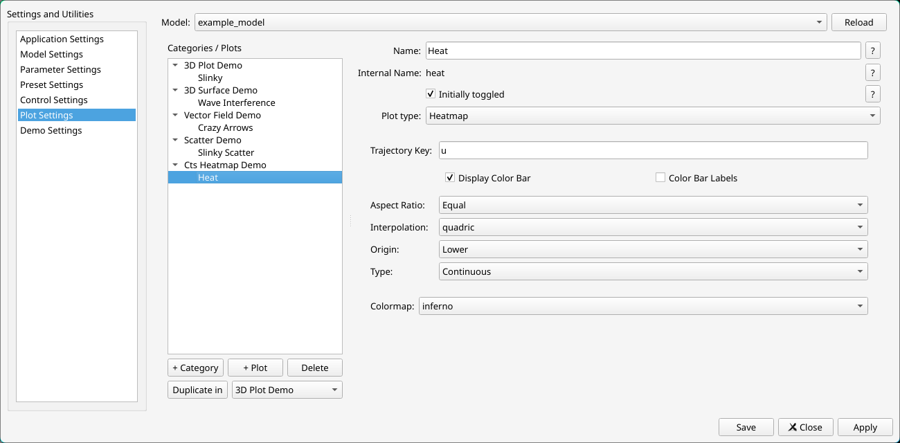

We see:

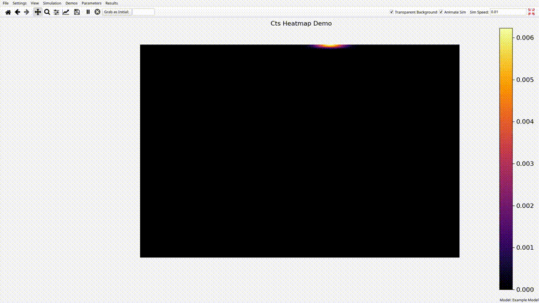

The color bar kinda goes crazy right now and pushes things around. Still working on that one. Not much to say beyond what was said earlier. The sim is just iteratively passing a 2D array of scalars to Overseer, which maps those values to colors via the inferno colormap. 
#### Discrete Grid Example
Let's make a grid for the agents of Epstein's civil violence model described above in the example for pie charts. First, we'll add a `get_grid` method to the model which can generate the 2D scalar data:

```python
    def get_grid(self):
        EMPTY   = 0
        COP     = 1
        QUIET   = 2
        ACTIVE  = 3
        ARRESTED= 4

        u = np.zeros((self.height, self.width), dtype= np.int8)

        for cell in self.grid.all_cells:
            x, y = cell.coordinate

            if cell.is_empty:
                u[y,x] = EMPTY
                continue

            agent = cell.agents[0]

            if isinstance(agent, Cop):
                u[y,x] = COP
            elif isinstance(agent, Citizen):
                if agent.state == CitizenState.ARRESTED:
                    u[y,x] = ARRESTED
                elif agent.state == CitizenState.ACTIVE:
                    u[y,x] = ACTIVE
                else:
                    u[y,x] = QUIET
            else:
                u[y,x] = EMPTY

        return u

```

Note the reversed $x$ and $y$ coordinates in $u$. Matplotlib expects a 2D array of the form (rows, columns), but the cell (x,y) coordinates specify x (i.e. the column) first. So we have to do the reverse. This allows us to update Overseer on the grid. Now we need to tell it how to color the grid. In the simulation function we add:

```python
def get_trajectories(params: Params):

    model = EpsteinModel(params)
    T = params.T

    traj = {
        "u": model.get_grid(),
        "cell_values": [0,1,2,3,4],
        "cell_colors": ["#717171" for i in range(5)],
        "states": model.get_agent_states(),
        "pie_color_map": {1: "#D73229", 2: "#A2D392", 3: "#565656"},
        "pie_label_map": {1: "Active", 2: "Quiet", 3: "Arrested"}
    }
    t = np.array([0])

    yield traj, t

    for i in range(T):
        model.step()

        traj["u"] = model.get_grid()
        traj["states"] = model.get_agent_states()
        t = np.append(t, i)
        if i % 100 == 0:
            model.get_agent_states_lazy()
        yield dict(traj), t.copy()
```

Note that the cell colors are all the same for each of the 5 distinct possible cell values. This is because we don't want to color the cells at all. Rather, we want a solid colored background, so that our 'agents' can do the visual work. But this doesn't require anything else from the Python code. We add these agents in the plot settings themselves like so:

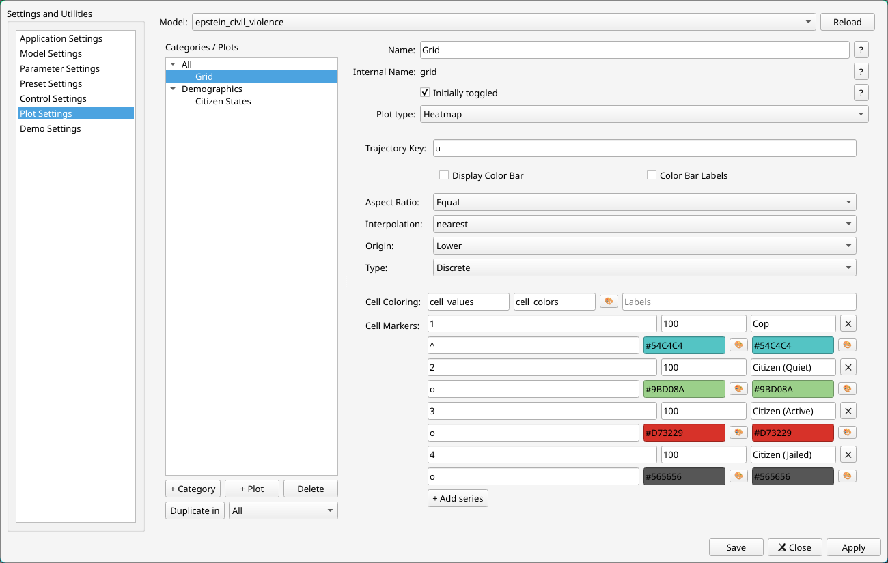

This says, make cops bluish triangles, and citizens circles. Citizen color determines their state: green is quiet, red is active, and gray is jail. The simulation looks coolest I think when the citizens are stationary, so I made that tweak, but it otherwise looks like this:

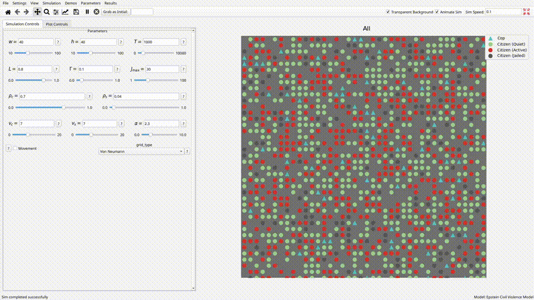

## Networks
While the feature is a little undercooked, it worked just fine right now for what it is. Overseer uses networkx to create networks (i.e. graphs). By that we mean that the networkx package has it's own code to create graphs using matplotlib, which allows us to view them through our matplotlib interface. An example set of settings looks like this:

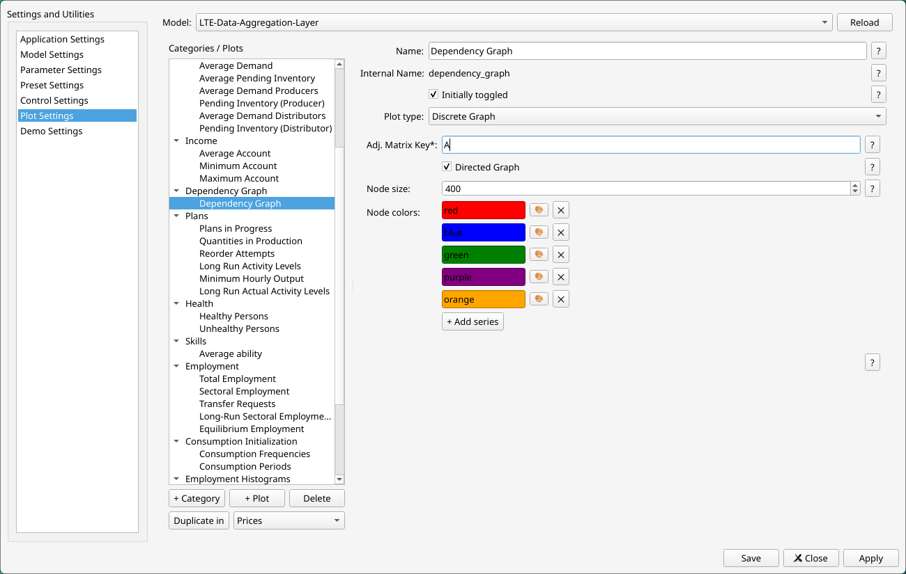

The only required entry here is $A$, which is an adjacency matrix. This can be either a Python list of lists, or a 2D numpy array, and it can be weighted or unweighted. There are checkboxes for whether you want the graph to be directed or undirected (i.e. have arrow pointers), and whether it is weighted or unweighted (not pictured) (i.e. whether to display the matrix entries by the network edges). Node size is self explanatory. 

Finally, the node colors are just a set of colors which Overseer will follow as a guide for the first however-many nodes it needs to make. If more nodes are needed, it will make up more colors that you didn't specify. These are the settings for the graph of the Leontief input/output matrix for my [labor time economy working group's simulation](https://github.com/BC-LTEWG/Labor-Time-Economy-Simulation). It looks like this:

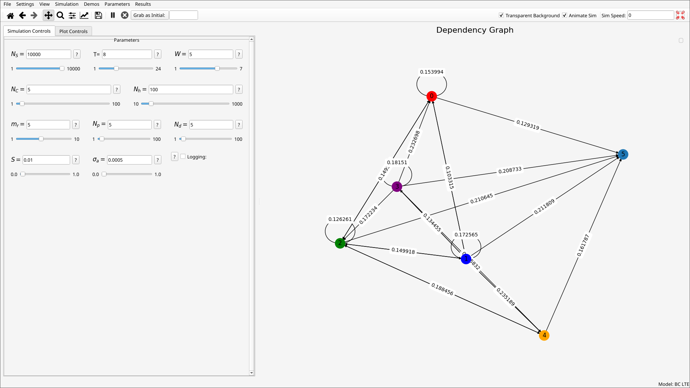