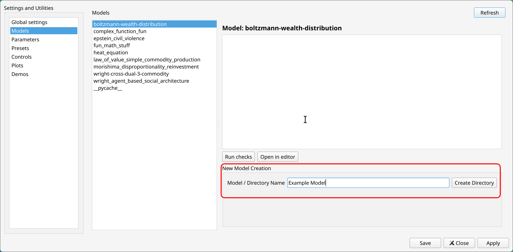
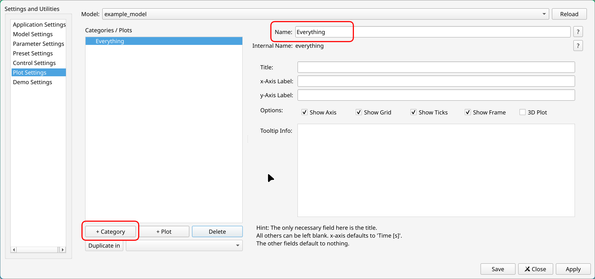
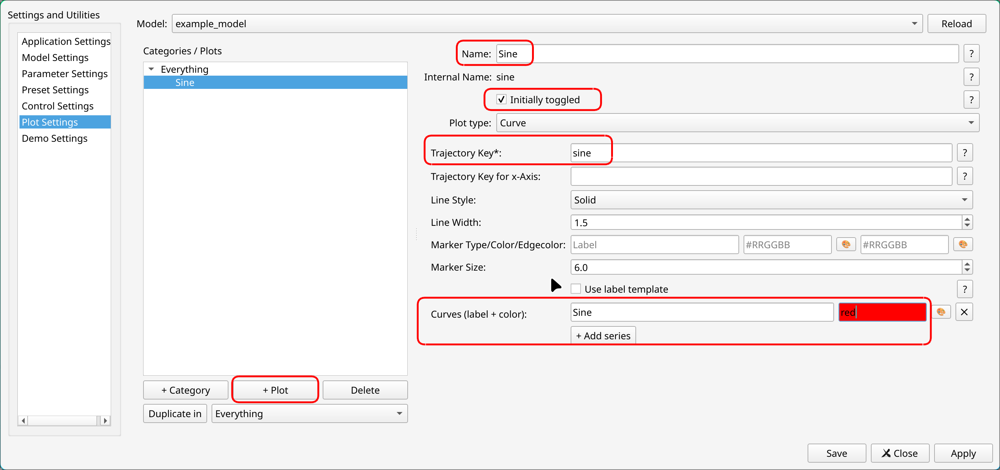
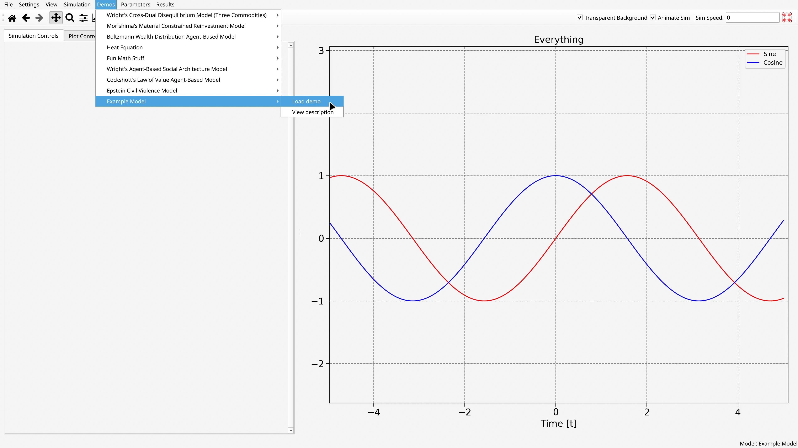

The best way to learn how to use Overseer is to make a few simple models on your own. This tutorial will walk you through doing just that. 
# Building a Model

## Step 1: Create a Model
To get started, navigate in the top menu bar to Settings -> Model Settings. Here you will see a list of models that have been created already - likely just some of my own models, which come packaged with Overseer as examples.

From here, you can create a new model by simply typing a name into the Model / Directory Name entry field and clicking the "Create Directory" button. We'll create one called Example Model.



Once you've done that, you should immediately see an item for your model appear in the list. The name won't be exactly the same as what you typed, but will be similar. 

What just happened? When you first load into Overseer, if you don't have one already, a user data folder called Overseer is created in your user Documents folder. Inside of this is a subdirectory called `models`, which contains a folder for each model that you see listed here. We will keep things brief on this first pass, because there is, in principle, only a single file that you ever actually need to edit yourself to get your model up and running - that file is `simulation.py`. If you select your model in the list and click "Open in Editor", you will open right into it. (You can select your preferred IDE in the application settings.) Alternatively, you can simple open it however you normally would. 

## Step 2: Define Your Sim Function

Inside of the `simulation.py` file for your example model, you should some minimal boilerplate starter code:

```python
from typing import Any
from .parameters import Params
from overseer.tools.dataclasses import Replace, Extend, Append
import numpy as np

def get_trajectories(params: Params) -> dict[str, Any]:
    pass
```

In this file, you are expected to define a simulation function. A simulation function is a normal Python function which takes a single input, which we will talk about in the next section, and returns a dictionary output. This dictionary in principle contains any and all information which you want to use for your plots in Overseer.

Let's have our `get_trajectories` function just create some basic plots of Sine and Cosine:

```python
from typing import Any
from .parameters import Params
from overseer.tools.dataclasses import Replace, Extend, Append
import numpy as np

def get_trajectories(params: Params) -> tuple[dict[str, Any], Any | None]:
    t = np.linspace(-5,5,300)
    traj = {
	    "sine": np.sin(t),
	    "cosine": np.cos(t)
    }
    
    return traj, t
```

If you aren't familiar with Numpy, `np.linspace(-5,5,300)` creates an array of 300 equally spaced numbers between -5 and 5 (inclusive). This will serve as the independent variable, or x-axis. By returning `t` as a second argument like this, we are saying: by default, if the user doesn't specify something different, you are plotting everything with respect to `t`. Alternatively, you can include t as a key in the dictionary:

```python
from typing import Any
from .parameters import Params
from overseer.tools.dataclasses import Replace, Extend, Append
import numpy as np

def get_trajectories(params: Params) -> tuple[dict[str, Any], Any | None]:
    t = np.linspace(-5,5,300)
    traj = {
	    "t": t,
	    "sine": np.sin(t),
	    "cosine": np.cos(t)
    }
    
    return traj
```

If you don't include `t` as a second output, Overseer will automatically look for a "t" key in the output dictionary to use when it doesn't know what your data for a curve or scatter plot should be plotted with respect to. You could also forego on a "t" array entirely, and specify all independent variable axes manually. For some applications, such as the creation of things like heatmaps and pie charts, this is the most sensible option.

This is about as minimal as a model can get. Let's now save our file and return to the Overseer interface to finish creating our model and get our plots on the screen. 

## Step 3: Declare Your Plots
Back in Overseer, let's next move to the Plot Settings tab. Here, you tell Overseer what plots you want to see, how you want them to be organized, and what data to attempt to use for them. 

Plots are organized into **categories**. Think of a category as a collection of related plots that you might (or might not) want to look at at the same time. Create a new category by clicking the +Category button. There are a lot of optional settings here but we'll only bother to fill in the name field, and call this category Everything. 



After this, with the Everything category selected, we can click the +Plot button to create a new plot inside of this category. The picture below shows the relevant fields filled in for plotting our Sine function:



The most important field here is Trajectory Key*. This should be the key of the dictionary output from `get_trajectories` corresponding to the sine outputs. Again, since we either have returned a `t` array explicitly or have one in the output dictionary, we can leave the field underneath blank. Finally, the label + color field specifies what the curve should be listed as in the legend, and the color of the curve. 

To save a bit of time, you can click the Duplicate in button to create a copy of the Sine function, and change a few of the fields to create a Cosine plot. Go ahead and do this yourself, and then click Apply. 

## Step 4: Create a Demo
A **demo**, short for demonstration, is any particular thing which you are looking to 'show off' with your model. Presumably, if you have a very complex model with a lot of flexibility, you might want to create multiple demos for a single model. Click on Demo Settings. 

To create a new demo, click the +Demo button. There isn't a whole lot to specify here. We give our demo a display name and a description, then specify the model to connect it to, the particular function to target, and a default preset (which we don't need to worry about right now because we don't have any parameters). 


This is enough to see our functions. Go ahead and click Save to apply and close the settings. After this, you should be able to find your demo listed in the Demos dropdown of the top menu bar. Click load. 



We have some plots on the screen. Wonderful! But our Simulation Controls to the left are empty. Let's do something about that. 

You might have to do some adjusting to see the plots the way they are pictured. This can be done in a variety of ways, see [the controls section](Controls), but my preferred is to *right click* the screen and drag to change the horizontal and vertical magnification. Once you've found a setup you like, you can click View -> Save current axis settings to attach this view as the default when your demo loads, so that you don't have to futz around with the camera so much next time. 

## Step 5: Declare Parameters
Go to Settings -> Parameter Settings next. A **parameter** is any piece of data which controls something about the model. It can be an int, a float, a string, a Boolean, or even a Numpy array. Let's create two parameters to control the frequency and amplitude of our sine and cosine waves. We'll call them $a$ and $b$, declare them as floats, and have them both default to $1$. 


After this, click Apply, and then move to Control Settings. 

## Step 6: Create Controls
There is a lot to say about the control panel settings, but not a lot that *has* to be said or even understood fully to get a nice control panel up and running. This is because we have a built-in wizard for initializing your controls, assuming you've already declared some parameters. 


# Basic File Structure
New models are creates inside of the models folder. The basic structure must look exactly like this:

```
folder_name/
├── __init__.py
├── data/
│   ├── control_panel_data.yml
│   ├── extra_data.yml
│   ├── params.yml
│   └── plotting_data.yml
└── simulation/
    ├── __init__.py
    ├── parameters.py
    └── simulation.py
```
A wizard exists to create this initial structure for new models. Open up the `tools/modelling_tools.py` file in your editor of choice and run the create_new_model_dir() function with no arguments. It will create some initial contents for the files too for you to look through and get started. This wizard does *not* create the plotting_data.yml file. There is a separate wizard for that (see below). 

In addition to creating the model directory, you will also need to modify your config.yml file in the root directory of the project. Add an entry under model_specific_settings as well as under demos. Give it a name, a desc, set as default (if you want), as well as a simulation_model, simulation_function and default_preset at minimum. `simulation_model` should just be the name of the folder for your model. The other two will be discussed below. 

If these entries are added, when running the app you should see your model listed under Demos. Don't click it until following the further steps or it will crash.

The basic idea behind the files are as follows. In the `simulation` folder we have:
- `simulation.py` this contains functions representing different simulations which you want your model to perform. Multiply simulations are allowed, and can be swapped between within the app under Sims.
- `parameters.py` this defines a dataclass which contains all relevant starting parameters for your model. Any specific information you want the model to have during its simulation should be stored as a parameter within this dataclass. 

And in the `data` folder we have:
- `control_panel_data.yml` contains row-by-row information about the controls you want to have in the control panel.
- `params.yml` contains a list of possible starting parameters for your models. The application will be able to create, save, delete and rename them but you must supply it initially with at least one set of values for each parameter.
- `plotting_data.yml` contains plots which you want to be displayed within the application. 
- `extra_data.yml` semi-deprecated. Would only be needed if there were no parameters at all in the `params.yml` file, or if that file were not found. Application will look here for a fallback set of initial parameters.

Now that we have a basic idea of how all of these files fit together, let's go through each in more depth.
# The Simulation Files
## simulation.py
- A simulation function **must**
    - Take an instance of a dataclass as input
    - Return an output of the form `traj, t, e` where
        - `traj` is a dictionary of trajectories. Each trajectory is something you want to plot. Keys should be strings (a short name for the plot), and values should be 1D numpy arrays containing all points. 
        - `t` is a 1D numpy array which gets interpreted as the x-axis of any plot.
        - `e` is an Exception object. You can wrap your simulation in a `try-except` block, and if it fails you can output the exception object which will display within the app in the status bar. If you don't have an exception to pass, just make this third output `None`. 
    - Those are the *only* rules! Run code from other languages, agent based simulations, run numerical simulations of differential equations or just plot the line $y=x^2$!
- Multiple simulations are allowed. Typically, I only use one with behavior that is modified conditionally by the parameters. This is a matter of personal preference.
- In the `config.yml` file, make sure to include the name of the default simulation function that you want to use in the `simulation_function` entry of the entry for your model under `demos`.

## parameters.py
- The wizard will create the start of this file for you. It just needs to have a single class definition called `Params`, which gets the `@dataclass` decorator. What you put here should be fairly self-explanatory from the auto-generated file or the examples in other models that are included here. 

# The Data Files
## plotting_data.yml
This is where you specify the plots to display. **There is a wizard to help you create a new plotting_data.yml file**. To run it, open up `modelling_tools.py` inside of the tools directory of this project, add a call to `create_new_plot_dir()` in the `if __name__ == "__main__": block, and run the program. There is also a separate wizard for adding new plots to an existing `plotting_data.yml` file. To use this, add a call to `new_plots()` in `modelling_tools.py` and run the file. 

You still need to understand how the file is meant to be structured in order to properly make use of the wizards. The overall structure of the yaml file should be as follows:
```yaml
plot_category1:
    name: Name of Plot
    title: Your Title
    tooltip: Your tooltip
    x_label: Title of x-axis
    y_label: Title of y-axis
    plots:
        plot1:
            # settings for plot1
        plot2: 
            # settings for plot2
        # and so on
plot_category2: 
    # repeat structure 
```
From this we can see that plots are organized into categories. Categories appear to the user in a dropdown window. Upon choosing a category, a new set of plots will be available, as specified in the `plots` setting. If you don't care to organize your plots into categories, you don't have to. Just define a single category which will have every plot. Now let's move on to what the plot settings look like. A basic example of a plot looks like this:

```yaml
    equilibrium_rop:
      checkbox_name: Equilibrium Rate of Profit
      colors:
      - orange
      labels:
      - Equilibrium Profit Rate
      linestyle: dashed
      toggled: true
      traj_key: epr
```

- If no `checkbox_name` is specified, then the plot will always appear when the category is selected, and `toggled` can also be left out. 
- `colors` should be self-explanatory, except for mentioning that hex codes for colors are also allowed. `labels` are for the displayed legend. 
- Finally, and most importantly, `traj_key` is the key for the plot within the `traj` dictionary which your simulation function is expected to output. 

The above example plots a single scalar quantity over time. Sometimes however, we have vector trajectories which we want to plot. For example, if we have an economy with multiple commodities, then it's more convenient to have a single trajectories item which includes a 1D numpy array of price vectors instead of scalars, e.g.

```python
traj["p"] = [[1,2,3], [4,5,6], [7,8,9],...]
```

Assuming that your trajectories dictionary stores the prices like this, then the following plot entry will plot all of them as a group:
```yaml
    prices:
      checkbox_name: Unit Prices
      colors:
      - red
      - green
      - blue
      labels:
      - Price of Commodity 1
      - Price of Commodity 2
      - Price of Commodity 3
      on_startup: true
      toggled: true
      traj_key: p
```

- on_startup is a bit of a band-aid setting. I'm not sure if it is still needed. If you are having trouble getting your trajectories to display from the default category on start-up, go ahead and include this. Otherwise, *leave it out*.

## control_panel_data.yml
This file is where you specify, row by row, what controls you want to be displayed. Due to how finicky it can be to properly arrange the widgets in a good looking way, there is currently no wizard to help you create this file - you will have to do it yourself. The format of this yaml should be something like:
```yaml
divider1:
    title: My controls
    side: left # <- optional, can also be right or center, defaults to center
row1:
    widget_name1:
        control_type: type of widget
        param_name: name of parameter which the control is wired to
        # widget specific extra settings (See below)
        tooltip: String that displays when the user clicks the question mark next to the widget
    # more widgets...
# more dividers and rows...
```

Dividers are just meant to separate out groups of controls. The essential settings for each widget are the `control_type` which specifies what kind of widget you're making, and the `param_name`, which is which parameter (defined in your `parameters.py` file) the widget is expected to be wired to. The currently available control types are:
- `"dropdown"`: Good for qualitative parameters, such as strings or Booleans (sorry, no checkboxes right now)
- `"entry_block"`: Meant for numerical parameters, which **includes vectors and matrices**. See below for more info. Most of your widgets will be these.
- `"button_group`": Sets of buttons which execute functions related to your system. Limited functionality right now, see below for more info.

In more detail now:
### entry_block
An example entry block:
```yaml
  supply_shock_mag:
    control_type: "entry_block"
    param_name: "supply_shock_mag"
    label: '$\alpha_s = $'
    type: "scalar"
    range: [0, 1]
    scalar_type: "float"
    tooltip: "Controls the magnitude of the supply shocks."
```
Explanation: `control_type`, `param_name` and `tooltip` we already have mentioned. The other specific settings to the entry block widget are
- label: Exactly what it sounds like. Note that LaTeX is supported (use single-quotes). What would be displayed here is $\alpha_s = $ followed by an entry where the user can type values for the parameter.
- type: Should be either `"scalar"`, `"vector"`, or `"matrix"`. Depending on which of these is picked, different extra settings are expected.     
    - If it is a scalar, then additionally the application expects
        - range: For scalars, a slider is created. This range defines the left and right extremes of that slider
        - scalar_type: Self explanatory. Can be `"float"` or `"int"`
    - If it is a vector or a matrix, then additionally the application expects
        - dim: In the case of a vector, should be a single integer representing the dimension of the vector. Entries for each coordinate will be created as a column of text entries. In the case of a matrix, should be a pair of the form `[n,m]` where n and m are integers. What will be created is an $n \times m$ grid of text entries for each entry of the matrix.

### dropdown
An example of a dropdown:
```yaml
  economy_type:
    control_type: "dropdown"
    param_name: "economy_type"
    label: "Model Restrictions"
    names: ["Unrestricted", "Fixed Real Wage", "Non-decreasing Employment", "Fixed Struggle"]
    values: ["unrestricted", "fixed_real_wage", "nondecreasing_employment", "fixed_struggle"]
    tooltip: "Various restrictions which we may impose upon the economy. Fixed struggle combines a fixed money wage with non-decreasing employment. This could represent an economy in which the 'yellow' labor unions have significant institutional power and are able to keep the class struggle locked in a stalemate."
```
- For these widgets, the extra settings besides `control_type`, `param_name` and `tooltip` are:
    - label: What text gets displayed above the dropdown. LaTeX not supported currently.
    - names: The text options which the user will see
    - values: If the $i^{th}$ name is chosen in the dropdown, then the $i^{th}$ value of this list is what the application will set the parameter equal to. (So if this is supposed to be a Boolean, make sure that the associated values are `True` or `False` (no quotes).  

### button_group
This one is a little undercooked right now, but are perfectly usable within their currently limited scope. My only use for it has an entry like this
```yaml
  generation:
    control_type: "button_group"
    names: ["Random Parameters"]
    tooltips: ["Generate random parameters. Not entirely working at present."]
    display: "horizontal"
    functions: ["random_parameters"]
```
The idea is that it will create a set of buttons which perform various functions, either arranged horizontally or vertically according to the display setting. Functions for the buttons should be created inside of a file called `extra_functions.py` inside of the simulation folder of your model directory. These functions are expected to take an instance of your parameters dataclass as input and return a new parameters dataclass as output. Names specify the text which is displayed on the button. The $i^{th}$ name will be wired to the $i^{th}$ function. 

## params.yml
It should initially look like this: 
```yaml
presets:
  default_preset:
    name: Default
    desc: Info for the user
    params:
      A: [[0.2, 0.0, 0.4], [0.2, 0.8, 0.0], [0.0, 0.1, 0.1]]
      l: [0.7, 0.6, 0.3]
      # etcetera
```
The default preset does not have to be called `default_preset`, but whatever name you give it, you edit the `config.yml` file to include it as the `default_preset`. Note that not *all* parameters need to be specified here, as long as you specified default values for them in your `parameters.py` file. 

## extra_data.yml
You should be able to completely ignore this. If you are paranoid, just copy and paste your default preset into here like so
```yaml
default_preset:
   name: Default
   desc: Info for the user
   params:
      A: [[0.2, 0.0, 0.4], [0.2, 0.8, 0.0], [0.0, 0.1, 0.1]]
      l: [0.7, 0.6, 0.3]
      # etcetera
```
