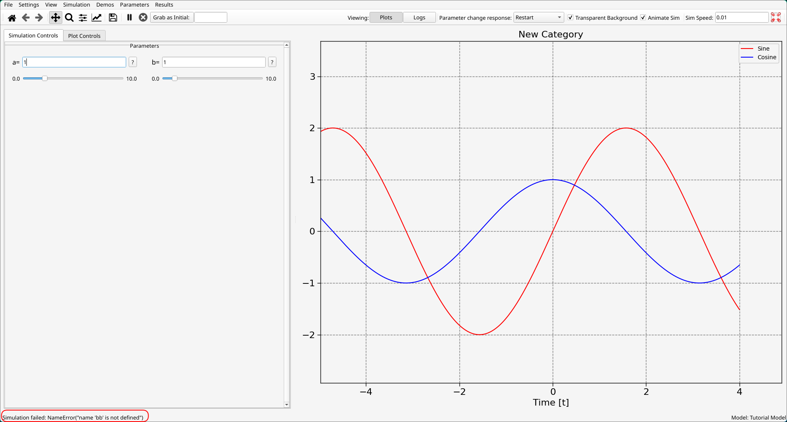
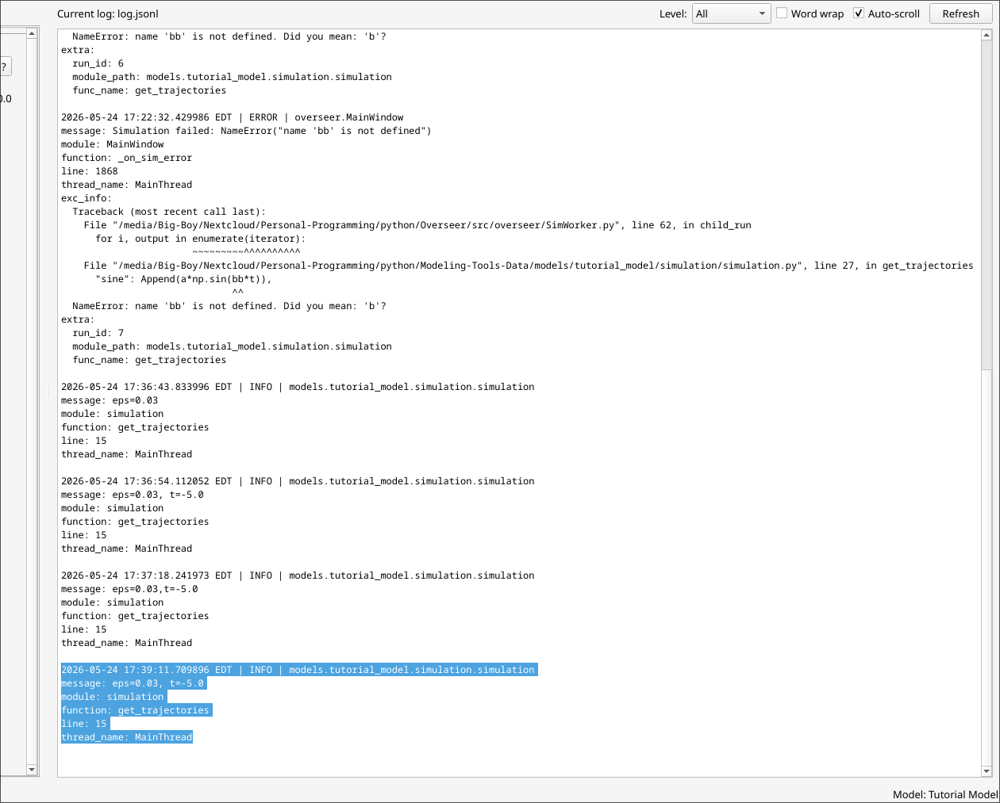

# The Logger and You
Overseer is meant to augment your existing IDE with a visualization layer, allowing for you to easily test you build, explore, and test your model all at once. Because of this, the ability to easily debug is important. Overseer comes with a logging agent which is very helpful to familiarize yourself with while creating your own models. 

## Reading Your Error Logs
Let's suppose we were building a model, try to run it, and it fails. When this happens, you should see a short message in the status bar telling you that your simulation failed:



To investigate this further, we can open up the Logs panel, either by clicking on the Logs button or using the keyboard shortcut (Alt+\`) (the \` is a backtick, the key at the top left of most keyboards):

```{raw} html
<div class="video-wrapper">
  <video
    controls
    autoplay
    muted
    loop
    playsinline
    preload="metadata"
    width="100%"
  >
    <source src="_static/videos/log-view-demo.mp4" type="video/mp4">
    Your browser does not support the video tag.
  </video>
</div>
```

Here you can view all of your logged data. When Overseer encounters an error, it automatically writes the full traceback message to a log file located in your user data folder, in json format. The logs panel merely gives you an easy place to view these logs quickly. Here we can track down the issue: my finger slipped and I wrote two b's on line 27!

After fixing the issue, just save the file and reload your model by going to Simulation -> Refresh simulation files, or just pressing F7. 

This is the basic loop when building models in Overseer. Write some code, encounter some bugs, read the error logs, fix the bugs, press F7, and then repeat. No closing and reopening is required. 

## Writing Your Own Logs
You are free to use the logger yourself to write whatever you want here for debugging or investigative purposes. To use the logger, add the following two lines to the *very top* of whatever file you are working on:

```python
import logging
logger = logging.getLogger(__name__)
```

After this, we can easily log whatever we want by calling the `logger.log` function:

```python
import logging
logger = logging.getLogger(__name__)

from .parameters import Params
from overseer.tools.dataclasses import Replace, Extend, Append
import numpy as np
import queue

def get_trajectories(params: Params, event_queue):
    a, b = params.a, params.b

    eps = 0.03
    t = -5.0

    logger.log(logging.INFO, f"{eps=}, {t=}") # <--

    for _ in range(300):
        try:
            info = event_queue.get_nowait()
            if info["event"] == "param_changed":
                param = info["param_name"]
                new_val = info["new_val"]
                if param == "a":
                    a = new_val
                elif param == "b":
                    b = new_val
        except queue.Empty:
            pass

        t += eps
        traj = {
            "sine": Append(a*np.sin(b*t)),
            "cosine": Append(b*np.cos(b*t))
        }

        yield traj, Append(t)
```

If we run our code now, we should see the message appear in the logs pane of Overseer upon refreshing and rerunning the simulation:



For the uninitiated, the `logging.INFO` part specifies the *log level*, which reflect the relative importance of the logged message. The log available log levels from least to most severe are:
1. DEBUG <- Currently filtered out by default.
2. INFO
3. WARNING
4. ERROR
5. CRITICAL

Instead of writing `logger.log(logging.INFO, msg)`, we could equivalently have just written `logger.info(msg)`. It's up to user preference. You can filter for a certain level of severity using the dropdown at the top of the logging pane. The full(ish) function signature for the `log` function is basically this:

```python
logger.log(
	logging.LOG_LEVEL,
	msg,
	*args,
	exc_info= None,
	extra= None,
	stack_info= False,
	stacklevel= 1
)
```

The most important optional arguments here for user's to be aware of by far are `exc_info` and `extra`.

- `exc_info` takes an exception instance as an argument. Using this, you can catch your own exceptions and report them without crashing your simulation. Example:
```python
    try:
        d = "dog"
        e = int(d)
    except ValueError as e:
        logger.error("What did you think was going to happen?", exc_info= e)
```

If this were written somewhere inside of our sim function and we ran it through Overseer, we would see the following appear in our log messages:
```
2026-05-24 17:48:30.480326 EDT | ERROR | models.tutorial_model.simulation.simulation
message: What did you think was going to happen?
module: simulation
function: get_trajectories
line: 21
thread_name: MainThread
exc_info:
	Traceback (most recent call last):
		File "<filepath>/simulation/simulation.py", line 19, in get_trajectories
			e = int(d)
		ValueError: invalid literal for int() with base 10: 'dog'
```
Note, the simulation would press on despite this error! 

- `extra` is just a dictionary containing anything else that you want to provide to be logged. So for example, we could try to monitor our simulation mid-way through:

```python
import logging
logger = logging.getLogger(__name__)

from .parameters import Params
from overseer.tools.dataclasses import Replace, Extend, Append
import numpy as np
import queue

def get_trajectories(params: Params, event_queue):
    a, b = params.a, params.b

    eps = 0.03
    t = -5.0

    for i in range(300):
        t += eps
        traj = {
            "sine": Append(a*np.sin(b*t)),
            "cosine": Append(b*np.cos(b*t))
        }
        if i == 150:
            extra = {
                "sine": traj["sine"].value,
                "cosine": traj["cosine"].value,
                "t": t
            }
            logger.info("Halfway there!", extra= extra)

        yield traj, Append(t)
```

We would see the following in our log display:
```
2026-05-24 17:54:42.220266 EDT | INFO | models.tutorial_model.simulation.simulation
message: Halfway there!
module: simulation
function: get_trajectories
line: 27
thread_name: MainThread
extra:
	sine: -0.45288628537907144
	cosine: 0.8915682881953273
	t: -0.4700000000000035
```

## Final Points
- Currently, there is no distinction between the logger for Overseer itself and the user's logger. Errors from Overseer will appear in these logs, and I will be keeping things this way at least until the app has been significantly more developed and battle tested. Expect to see error messages that you don't have anything to do with.
- The logger app's logger is set to INFO. Unless you change this, anything you choose to log in DEBUG mode will be ignored. To change this, go into the `logging_config.yml` file, find the handlers section, then find the app_file handler inside of that. Inside of that, change the level field to whatever you want. Changing it to debug should make your debug messages appear (along with other junk that you probably don't want to see.)