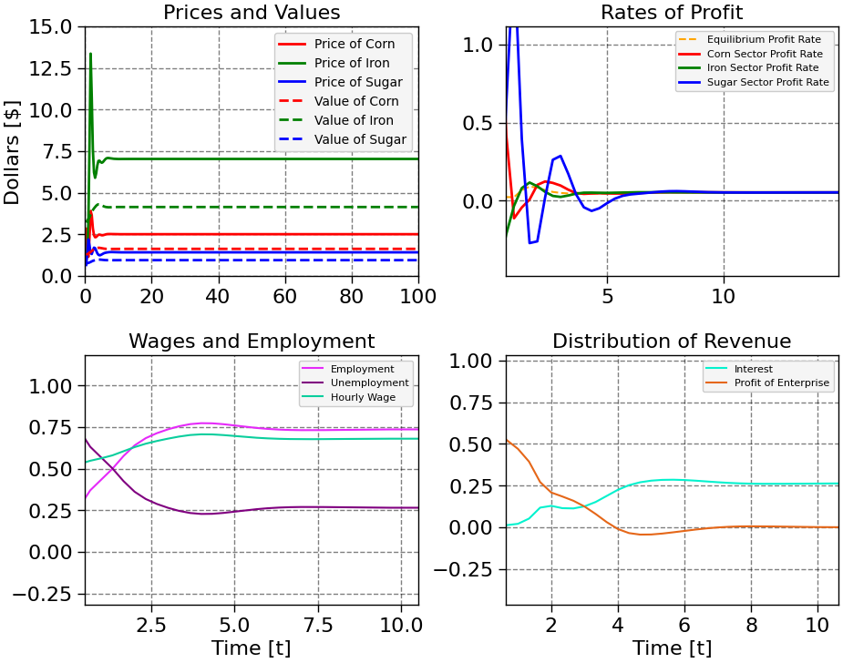
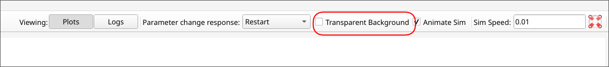
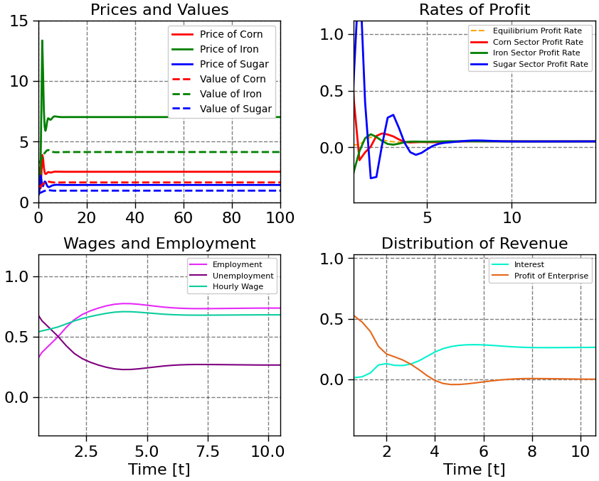

# Saving Pictures, Presets and Data
(pictures)=

## Pictures
Once you've got a nice figure set up, you can save a screenshot by clicking the floppy disk button in the toolbar, or by using the default keyboard shortcut Ctrl+S,S:

```{raw} html
<div class="video-wrapper">
  <video
    controls
    autoplay
    muted
    loop
    playsinline
    preload="metadata"
    width="100%"
  >
    <source src="_static/videos/screenshot-example.mp4" type="video/mp4">
    Your browser does not support the video tag.
  </video>
</div>
```

There is a bit of weirdness to the saving currently. You can see in this video that the figure gets smaller for some reason when the screenshot is taken. I fixed it by pressing F6. Nonetheless, the figure turned out fine:



Well, almost. The reason this happened is because the transparency is turned on, to make the figure blend in better with the background of Overseer. Make sure to uncheck this first in the toolbar:



After unchecking this and trying again we get this:



Okay, NOW it turned out fine. Nonetheless, you might still encounter some issues. Screenshots are not independent of your screens DPI or resolution. In the future I want to fix this but I don't know how right now.

You can change the default save directory for screenshots in the application settings. Additionally, you can change the default name of the save file:
### Image Template Names
The default image save name isn't really what it says on the tin. Rather, it is a template name that can change depending on your parameters, if you want it to. Here are some examples:  
- 'my_pic' will result in the save name defaulting to my_pic.png.  
- 'my_pic {a} {b}' will attempt to replace {a} and {b} with the values of the parameter named a and b in your model.  
- 'my_pic {a=}' will attempt to replace {a=} with the string 'a=\<value of a>'. So same as above except it titles the parameter with its name.
 
If a is not the name of a parameter in either of the above cases, then {a} will just be replaced with a in the name. This can help a lot with identifying specific images if you are saving a lot of them.
## Presets
If you've found a particularly noteworthy configuration of your parameters, you can save these settings and load them again whenever you want. 

```{raw} html
<div class="video-wrapper">
  <video
    controls
    autoplay
    muted
    loop
    playsinline
    preload="metadata"
    width="100%"
  >
    <source src="_static/videos/saving-a-preset.mp4" type="video/mp4">
    Your browser does not support the video tag.
  </video>
</div>
```

This is particularly useful if you are writing a paper and building a [release build of your model](feature-model-releases) to accompany it, as you can save a preset for every figure, allowing readers to easily not only see your results, but also easily *reproduce them*!

```{raw} html
<div class="video-wrapper">
  <video
    controls
    autoplay
    muted
    loop
    playsinline
    preload="metadata"
    width="100%"
  >
    <source src="_static/videos/preset-loading-example.mp4" type="video/mp4">
    Your browser does not support the video tag.
  </video>
</div>
```

Note here that the axis settings have also been saved as part of the preset. You can do this while saving the preset by clicking the checkbox. 

## Data
Sometimes you'll want to save presets to reproduce results, and other times just want to save the results themselves. This is nearly identical to saving a preset, except instead of clicking Presets in the top menu, we click Results. 

The results data is saved using Numpy's own [(.npz) file format](https://numpy.org/doc/stable/reference/generated/numpy.savez.html). This not only allows for blazing fast saving and loading, it also makes your data completely portable. It saves to a directory called saved_results inside of your model folder. You can analyze it using whatever other tools you want. 

**WARNING**: The Numpy `savez_compressed` method isn't magic, and will fail on *ragged* datasets - i.e. 2D arrays whose rows aren't all the same size. Right now, Overseer looks for these, and when it finds them it instead saves them to the accompanying yaml file instead, which stores metadata such as axis settings when you save results. This will *massively* slow down the saving process and massively increase the size of the file, since it uncompressed. A more elegant solution is sorely needed, but in the meantime my advice is to simply AVOID having any ragged datasets in your results. 
